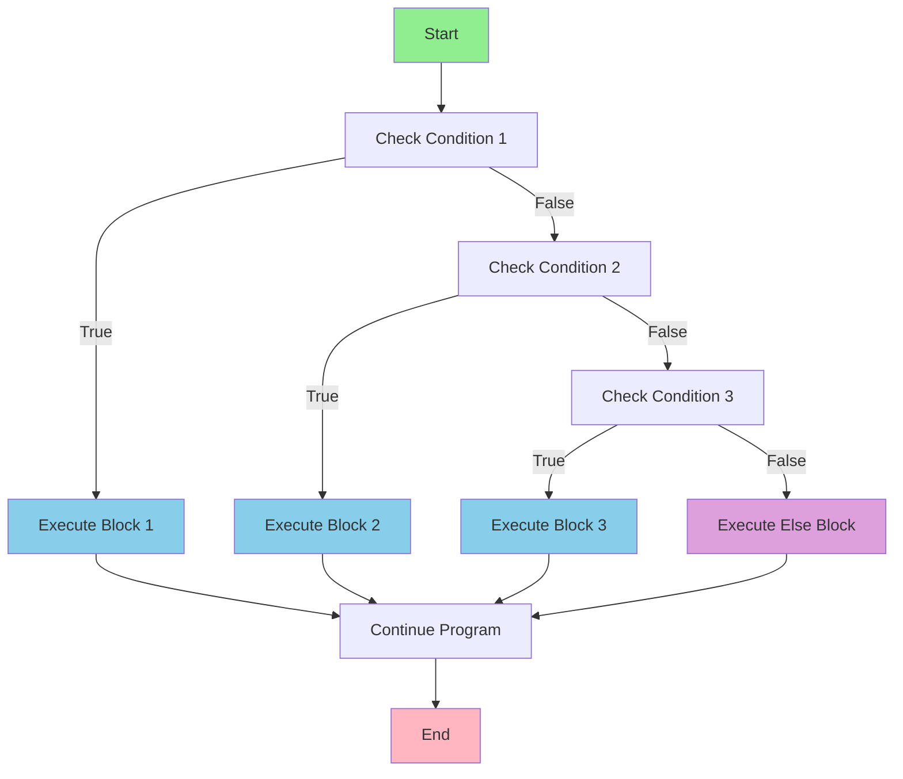
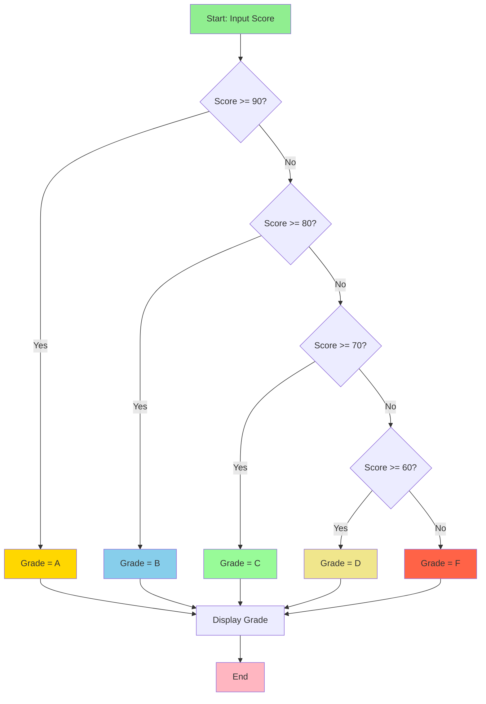
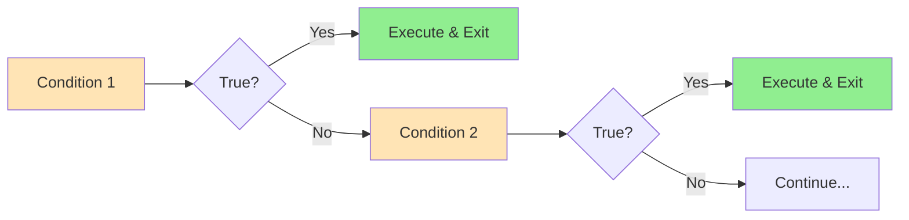

The <mark style="background: #D33AFFA6;">else if statement</mark>  in C++ is used to check multiple conditions in sequence. It provides a way to execute different blocks of code based on different conditions, creating what's commonly known as an "if-else-if ladder."


## Basic Syntax

```cpp
if (condition1) {
    // Code block 1 - executes if condition1 is true
} else if (condition2) {
    // Code block 2 - executes if condition1 is false and condition2 is true
} else if (condition3) {
    // Code block 3 - executes if condition1 and condition2 are false, condition3 is true
} else {
    // Default code block - executes if all conditions are false (optional)
}
```

## How It Works

If Condition 1 evaluates to true, Statement 1 is executed, and the rest of the ladder is skipped. If Condition 1 is false, the program checks Condition 2, and so on. Only one code block gets executed according to the matching condition.

### Key Points:
- **Sequential Evaluation**: Conditions are checked from top to bottom
- **First Match Wins**: Only the first true condition's block executes
- **Early Exit**: Once a condition is true, remaining conditions are not checked
- **Optional Else**: The final else block is optional and serves as a default case

## Flowchart Visualization



### Grade System Example Flowchart



## Basic Examples

### Example 1: Grade Calculator
```cpp
#include <iostream>
using namespace std;

int main() {
    int score = 85;
    char grade;
    
    if (score >= 90) {
        grade = 'A';
        cout << "Excellent! Grade: " << grade << endl;
    } else if (score >= 80) {
        grade = 'B';
        cout << "Good! Grade: " << grade << endl;
    } else if (score >= 70) {
        grade = 'C';
        cout << "Average. Grade: " << grade << endl;
    } else if (score >= 60) {
        grade = 'D';
        cout << "Below Average. Grade: " << grade << endl;
    } else {
        grade = 'F';
        cout << "Failed. Grade: " << grade << endl;
    }
    
    return 0;
}
// Output: Good! Grade: B
```

### Example 2: Day of Week
```cpp
#include <iostream>
using namespace std;

int main() {
    int day = 3;
    
    if (day == 1) {
        cout << "Monday - Start of work week!" << endl;
    } else if (day == 2) {
        cout << "Tuesday - Keep going!" << endl;
    } else if (day == 3) {
        cout << "Wednesday - Hump day!" << endl;
    } else if (day == 4) {
        cout << "Thursday - Almost there!" << endl;
    } else if (day == 5) {
        cout << "Friday - TGIF!" << endl;
    } else if (day == 6) {
        cout << "Saturday - Weekend fun!" << endl;
    } else if (day == 7) {
        cout << "Sunday - Rest day!" << endl;
    } else {
        cout << "Invalid day number!" << endl;
    }
    
    return 0;
}
// Output: Wednesday - Hump day!
```

### Example : User Permission System
```cpp
#include <iostream>
#include <string>
using namespace std;

int main() {
    string userRole = "editor";
    string action = "delete";
    
    cout << "User Role: " << userRole << endl;
    cout << "Requested Action: " << action << endl << endl;
    
    if (userRole == "admin") {
        cout << "✅ Access Granted: Full administrative privileges" << endl;
        cout << "You can: create, read, update, delete, manage users" << endl;
    } else if (userRole == "editor") {
        if (action == "delete") {
            cout << "❌ Access Denied: Editors cannot delete content" << endl;
        } else {
            cout << "✅ Access Granted: Editor privileges" << endl;
            cout << "You can: create, read, update content" << endl;
        }
    } else if (userRole == "viewer") {
        if (action == "read") {
            cout << "✅ Access Granted: View-only access" << endl;
        } else {
            cout << "❌ Access Denied: Viewers can only read content" << endl;
        }
    } else if (userRole == "guest") {
        cout << "❌ Access Denied: Please log in to access content" << endl;
    } else {
        cout << "❌ Error: Invalid user role" << endl;
    }
    
    return 0;
}
// Output: ❌ Access Denied: Editors cannot delete content
```


## Best Practices

### 1. Order Conditions Strategically
Use early return to reduce the complexity of If else chain and arrange conditions from most specific to most general or most likely to least likely.

```cpp
// Good: Most specific conditions first
if (score == 100) {
    cout << "Perfect score!" << endl;
} else if (score >= 90) {
    cout << "Grade A" << endl;
} else if (score >= 80) {
    cout << "Grade B" << endl;
}

// Avoid: General conditions first (specific conditions never reached)
if (score >= 80) {  // This catches 100, so perfect score never shows
    cout << "Grade B or better" << endl;
} else if (score == 100) {  // Never executed!
    cout << "Perfect score!" << endl;
}
```

### 2. Use Clear and Descriptive Conditions
```cpp
// Good: Clear variable names and readable conditions
bool isWeekend = (day == 6 || day == 7);
bool isBusinessHours = (hour >= 9 && hour <= 17);

if (isWeekend) {
    cout << "Weekend rates apply" << endl;
} else if (isBusinessHours) {
    cout << "Business hours rates" << endl;
} else {
    cout << "After hours rates" << endl;
}

// Avoid: Cryptic conditions
if (d == 6 || d == 7) {
    // What does this mean?
}
```

### 3. Consider Using Constants
```cpp
// Good: Use constants for magic numbers
const int GRADE_A_THRESHOLD = 90;
const int GRADE_B_THRESHOLD = 80;
const int GRADE_C_THRESHOLD = 70;

if (score >= GRADE_A_THRESHOLD) {
    grade = 'A';
} else if (score >= GRADE_B_THRESHOLD) {
    grade = 'B';
} else if (score >= GRADE_C_THRESHOLD) {
    grade = 'C';
}
```

### 4. Avoid Deep Nesting
Move nested blocks to separate methods and break complex chains into smaller, more manageable pieces.

```cpp
// Good: Separate functions for complex logic
bool isValidUser(const string& username, const string& password) {
    return (username.length() >= 3 && password.length() >= 8);
}

bool hasPermission(const string& role, const string& action) {
    if (role == "admin") return true;
    if (role == "editor" && action != "delete") return true;
    if (role == "viewer" && action == "read") return true;
    return false;
}

// Main logic becomes cleaner
if (!isValidUser(username, password)) {
    cout << "Invalid credentials" << endl;
} else if (!hasPermission(role, action)) {
    cout << "Access denied" << endl;
} else {
    cout << "Access granted" << endl;
}
```

## Performance Considerations

### Condition Ordering for Performance
Compiler optimization can help with performance, but proper ordering of conditions from most likely to least likely can improve average-case performance.

```cpp
// Good: Most common cases first
if (temperature >= 15 && temperature <= 25) {  // Most common range
    return "comfortable";
} else if (temperature > 25) {                 // Hot weather
    return "hot";
} else {                                       // Cold weather (least common)
    return "cold";
}
```

### Memory Usage Flowchart


## Common Mistakes

### 1. Missing Braces
```cpp
// Dangerous: Without braces
if (x > 10)
    cout << "Greater than 10" << endl;
    cout << "This always executes!" << endl;  // Not part of if!
else if (x > 5)
    cout << "Greater than 5" << endl;

// Safe: Always use braces
if (x > 10) {
    cout << "Greater than 10" << endl;
    cout << "This is part of if block" << endl;
} else if (x > 5) {
    cout << "Greater than 5" << endl;
}
```

### 2. Logical Errors in Conditions
```cpp
// Wrong: Overlapping conditions
if (score > 80) {          // This catches 90+ scores
    grade = 'B';
} else if (score > 90) {   // Never reached!
    grade = 'A';
}

// Correct: Proper ordering
if (score > 90) {
    grade = 'A';
} else if (score > 80) {
    grade = 'B';
}
```

### 3. Inefficient String Comparisons
```cpp
// Inefficient: Multiple string comparisons
if (status == "active" || status == "ACTIVE" || status == "Active") {
    // Handle active status
}

// Better: Convert to lowercase once
string lowerStatus = toLowerCase(status);
if (lowerStatus == "active") {
    // Handle active status
}
```


## Summary

The else if statement is a powerful control structure that allows you to:

- **Handle Multiple Conditions**: Test several conditions in sequence
- **Implement Decision Trees**: Create complex decision-making logic
- **Ensure Mutual Exclusivity**: Only one condition block executes
- **Provide Default Handling**: Use final else for unmatched cases


