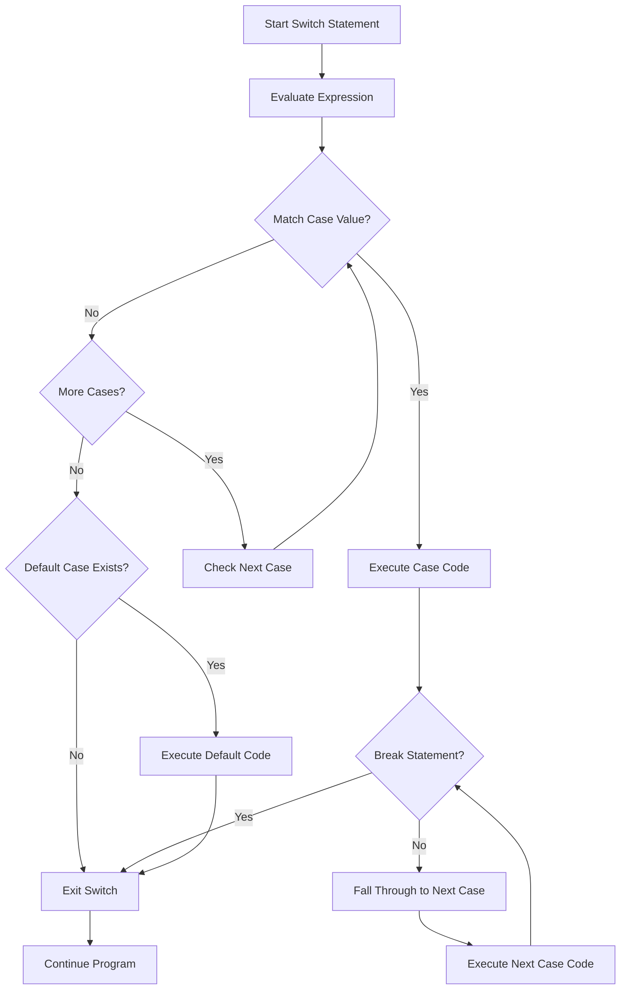

#### **The switch statement**
is a control flow statement that allows a program to execute different code blocks based on the value of an expression. It's preferred over if-else statements when testing a single expression (with a non-boolean integral type or an enumerated type) for equality against a small set of values.

## Basic Syntax
```C++
switch (expression)
{
case x:
    // code block
    break;

case y:
    // code block
    break;

default:
    // code block
}
```

## Execution Flow



## Basic Example
```cpp
int day = 4;

switch (day)
{
case 1: 
    cout << "Sun";
    break;

case 2: 
    cout << "Mon";
    break;

case 3: 
    cout << "Tue";
    break;

case 4: 
    cout << "Wed";
    break;

case 5: 
    cout << "Thur";
    break;

case 6: 
    cout << "Fri";
    break;

case 7: 
    cout << "Sat";
    break;

default: 
    cout << "Not a week day";
    break;
}
```

## Advanced Example: Using Switch with Enums
```cpp
#include <iostream>
#include <string>
using namespace std;

enum enmyColor { Red = 1, Blue = 2, Green = 3, Yellow = 4 };

int main()
{
    cout << "***************************************\n";
    cout << "Please Chose the number of your color ?\n";
    cout << "(1) Red \n";
    cout << "(2) Blue \n";
    cout << "(3) Green \n";
    cout << "(4) Yellow \n";
    cout << "***************************************\n";

    int C;
    enmyColor Color;
    cin >> C;

    Color = enmyColor(C); // casting (changing int to enum)

    switch (Color)
    {
    case enmyColor::Red:
        system("color 4F");
        break;
    case enmyColor::Blue:
        system("color 1F");
        break;
    case enmyColor::Green:
        system("color 2F");
        break;
    case enmyColor::Yellow:
        system("color 6F");
        break;
    default:
        system("color 4F");
        break;
    }

    return 0;
}
```

## Key Concepts

### 1. Fall-Through Behavior
If you don't include a break statement, execution will "fall through" to the next case, executing all subsequent code until a break is encountered.

```cpp
switch(value) {
    case 1:
        function1();
        // No break - falls through
    case 2:
        function2();
        break;
    case 3:
        function3();
        break;
}
```


### Multiple Cases for Same Action
```cpp
switch(grade) {
    case 'A':
    case 'B':
    case 'C':
        cout << "Pass";
        break;
    case 'D':
    case 'F':
        cout << "Fail";
        break;
}
```

## Rules and Limitations

### Data Types
The case values must be of int or char type. You can also use:
- Integer types (int, long, short)
- Character types (char)
- Enumerated types
- Boolean types

### Case Values Must Be Constants
```cpp
// ✅ Valid
case 5:
case 'A':
case MyEnum::Value:

// ❌ Invalid
case variable:  // Variables not allowed
case x + 1:     // Expressions not allowed
```

## Switch vs If-Else: When to Use Which?

### Use Switch When:
1. **Testing a single variable against multiple constant values**
2. **Working with enums or integer types**
3. **You have 5+ conditions to check** - switch statements are generally faster than if-else when there are many cases due to compiler optimizations like jump tables
4. **Code readability is important** - Switch statements produce cleaner code as they express semantics and reduce duplication

### Use If-Else When:
1. **Testing complex conditions or ranges**
2. **Working with boolean expressions**
3. **Need to test different variables**
4. **Fewer than 5 conditions** - there's no significant performance improvement with switch for few cases

### Performance Considerations
Switch statements can benefit from compiler optimizations. For contiguous integer values, compilers might use jump tables providing constant-time complexity. For sparse values, binary search mechanisms might be used.

## Best Practices

1. **Always include break statements** unless intentional fall-through is desired
2. **Always include a default case** for error handling
3. **Use [[fallthrough]] attribute** for intentional fall-through in C++17+
4. **Prefer switch over if-else** when testing single expressions against multiple constant values
5. **Keep case blocks simple** - use functions for complex logic
6. **Order cases logically** or by frequency of use

## Common Pitfalls

### Missing Break Statement
```cpp
// ❌ Problematic - unintended fall-through
switch(day) {
    case 1:
        cout << "Monday";
        // Missing break!
    case 2:
        cout << "Tuesday";  // This will also execute for case 1!
        break;
}
```

### Forgetting Default Case
```cpp
// ❌ Missing default case
switch(userInput) {
    case 1:
        handleOption1();
        break;
    case 2:
        handleOption2();
        break;
    // What happens if userInput is 3?
}

// ✅ Better with default
switch(userInput) {
    case 1:
        handleOption1();
        break;
    case 2:
        handleOption2();
        break;
    default:
        cout << "Invalid option!";
        break;
}
```

## Summary
Switch statements are powerful control structures that provide clean, efficient ways to handle multiple conditions based on a single expression's value. They're particularly useful with enums and integer types, offering better performance and readability than long if-else chains when used appropriately.