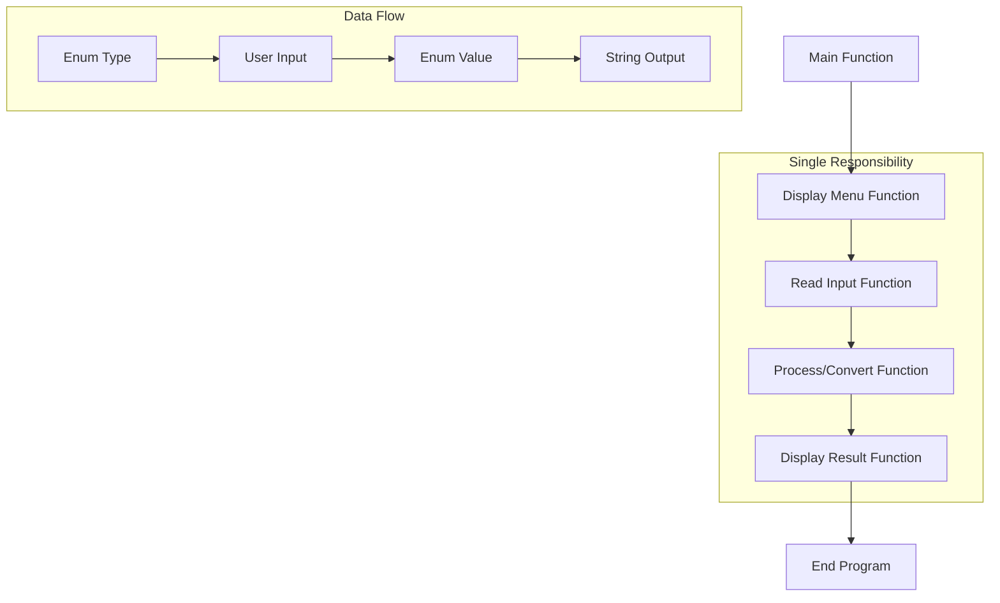

Function composition is a fundamental programming concept where complex operations are built by combining simpler functions. When working with enums, this approach promotes clean, maintainable, and modular code by following the separation of concerns principle - organizing code into distinct sections where each addresses a single concern.

## Core Principles

### 1. Separation of Concerns
Separation of concerns (SoC) is the design principle that guides modular programming. In our examples, we separate:
- **Data Definition** (enum declarations)
- **User Interface** (menu display functions)
- **Input Handling** (reading user input)
- **Data Processing** (conversion and validation)
- **Output Formatting** (display functions)

### 2. Function Composition Flow



## Example 1: Week Days Management System

```cpp
#include <iostream>
using namespace std;

enum enWeekDays {Mon=1, Tue=2, Wed=3, Thu=4, Fri=5, Sat=6, Sun=7 };

void ShowDaysMenu()
{
    cout << "************************************************* \n\n";
    cout << "                  WEEK MENU                        \n\n";
    cout << "************************************************* \n\n";
    cout << "1: Monday \n";
    cout << "2: Tuesday \n";
    cout << "3: Wednesday \n";
    cout << "4: Thursday \n";
    cout << "5: Friday \n";
    cout << "6: Saturday \n";
    cout << "7: Sunday \n\n";
    cout << "*************************************************** \n";

    cout << "Enter Your Choice ? ";
}

enWeekDays ReadWeekDays()
{
    enWeekDays WeekDays;
    int WD;
    cin >> WD;

    return (enWeekDays)WD;
}

string GetWeekDayName(enWeekDays Week)
{
    switch (Week)
    {
    case enWeekDays::Mon :
        return "Monday";
    case enWeekDays::Tue:
        return "Tuesday";
    case enWeekDays::Wed:
        return "Wednesday";
    case enWeekDays::Thu:
        return "Thursday";
    case enWeekDays::Fri:
        return "Friday";
    case enWeekDays::Sat:
        return "Saturday";
    case enWeekDays::Sun:
        return "Sunday";
    default:
        return "Invalid Day";
    }
}

int main()
{
    ShowDaysMenu();
    cout << "Your Day is : " << GetWeekDayName(ReadWeekDays()) << endl;
    return 0;
}
```

## Example 2: Sports Club Selection System

```cpp
#include <iostream>
#include <string>
using namespace std;

enum enClub { Raja=1, Barca=2, Madrid=3, Liv=4, City=5, Ars=6};

void printMenu()
{
    cout << "********************************************** \n\n";
    cout << "                  Club                         \n\n";
    cout << "********************************************** \n";
    cout << "Choose your Club as following : \n\n";
    cout << "(1) : Raja \n";
    cout << "(2) : Barca \n";
    cout << "(3) : Madrid \n";
    cout << "(4) : Liverpool \n";
    cout << "(5) : City \n";
    cout << "(6) : Arsenal \n";
    cout << "********************************************** \n";
}

enClub ReadUserClub()
{
    enClub Club;
    int UC;
    cin >> UC;

    Club = enClub(UC);
    return Club;
}

string printClub(enClub Club)
{
    switch (Club)
    {
    case enClub::Raja:
        return "Raja Casablanca";
    case enClub::Barca:
        return "FC Barcelona";
    case enClub::Madrid:
        return "Real Madrid";
    case enClub::Liv:
        return "Liverpool FC";
    case enClub::City:
        return "Manchester City";
    case enClub::Ars:
        return "Arsenal FC";
    default:
        return "Invalid Selection";
    }
}

int main()
{
    printMenu();
    cout << "Your chosen club: " << printClub(ReadUserClub()) << endl;
    return 0;
}
```

## Advanced Function Composition Patterns

### 1. Input Validation with Error Handling

```cpp
#include <iostream>
#include <limits>
using namespace std;

enum enGrade { A=1, B=2, C=3, D=4, F=5 };

bool IsValidGrade(int grade)
{
    return (grade >= 1 && grade <= 5);
}

enGrade ReadGradeWithValidation()
{
    int grade;
    
    do {
        cout << "Enter grade (1-5): ";
        cin >> grade;
        
        if (cin.fail()) {
            cin.clear();
            cin.ignore(numeric_limits<streamsize>::max(), '\n');
            cout << "Invalid input! Please enter a number.\n";
            continue;
        }
        
        if (!IsValidGrade(grade)) {
            cout << "Invalid grade! Please enter 1-5.\n";
        }
        
    } while (!IsValidGrade(grade));
    
    return static_cast<enGrade>(grade);
}

string GetGradeDescription(enGrade grade)
{
    switch (grade)
    {
    case enGrade::A: return "Excellent";
    case enGrade::B: return "Good";
    case enGrade::C: return "Average";
    case enGrade::D: return "Below Average";
    case enGrade::F: return "Fail";
    default: return "Unknown";
    }
}

double GetGradePoints(enGrade grade)
{
    switch (grade)
    {
    case enGrade::A: return 4.0;
    case enGrade::B: return 3.0;
    case enGrade::C: return 2.0;
    case enGrade::D: return 1.0;
    case enGrade::F: return 0.0;
    default: return 0.0;
    }
}
```

### 2. Multiple Function Composition

```cpp
void DisplayCompleteGradeInfo()
{
    enGrade userGrade = ReadGradeWithValidation();
    
    cout << "\n=== Grade Information ===" << endl;
    cout << "Grade: " << static_cast<char>('A' + userGrade - 1) << endl;
    cout << "Description: " << GetGradeDescription(userGrade) << endl;
    cout << "Points: " << GetGradePoints(userGrade) << endl;
    cout << "========================" << endl;
}
```


## Best Practices

### 1. Function Design Principles
- **Single Responsibility**: Each function should have one clear purpose
- **Pure Functions**: Functions should return the same output for the same input
- **Meaningful Names**: Function names should clearly describe what they do
- **Input Validation**: Always validate user input before processing

### 2. Enum Best Practices
- Use uppercase for enum values as it's considered good practice
- Always provide a default case in switch statements
- Prefer enum class over plain enum for type safety
- Use explicit values when the numeric value matters
- Group related enums logically


## Performance Considerations

### Function Call Overhead
- Modern compilers can inline simple functions
- For performance-critical code, consider `inline` keyword
- Function composition adds minimal overhead with optimizations enabled

### Memory Usage
- Enums typically use integer storage (4 bytes by default)
- Functions don't consume additional memory beyond their code
- Local variables in functions are stack-allocated

## Summary

Function composition with enums promotes:
1. **Modularity**: Each function has a specific responsibility
2. **Reusability**: Functions can be used in different contexts
3. **Maintainability**: Changes to one function don't affect others
4. **Testability**: Individual functions can be tested in isolation
5. **Readability**: Code becomes self-documenting through meaningful function names

This approach follows the most important principle in Software Engineering - the Separation of Concerns (SoC): decomposing software systems into parts that overlap in functionality as little as possible.