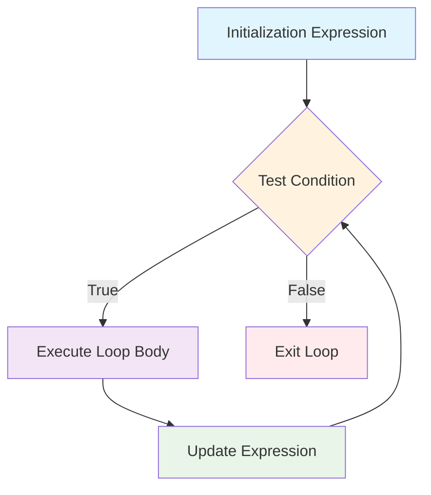

#### **The for loop**
is one of the most fundamental control structures in C++, providing a compact way to iterate over a sequence of values. It's particularly useful when you know in advance how many times you want to execute a block of code.

## Basic Syntax
```cpp
 for (initialization; condition; update)
 {
   // body of loop
 }
```

## How it Works?



### Execution Steps:
1. **Initialization**: Executed only once at the beginning
2. **Condition Check**: Evaluated before each iteration
3. **Loop Body**: Executed if condition is true
4. **Update**: Executed after each iteration
5. **Repeat**: Goes back to step 2

## Basic Examples

### Example 1: Counting Up
```cpp
 for (int i = 1; i <= 5; i++)
 {
   cout << i << endl;
 }
 // Output: 1 2 3 4 5
```

### Example 2: Repeating Actions
```cpp
for (int i = 1; i <= 5; i++)
{
    cout << "Walid" << endl;
}
// Output: Walid (printed 5 times)
```

### Example 3: Large Iterations
```cpp
for (int i = 1; i <= 100; i++)
{
    cout << "Subhan Allah " << i << endl;
}
// Output: Subhan Allah 1, Subhan Allah 2, ..., Subhan Allah 100
```

### Example 4: Counting Down
```cpp
 for (int i = 5; i >= 1; i--)
 {
   cout << i << endl;
 }
 // Output: 5 4 3 2 1
```

### Example 5: Custom Increment (Odd Numbers)
```cpp
 for(int i = 1; i <= 10; i = i + 2)
 {
   cout << i << endl;
 }
 // Output: 1 3 5 7 9
```

### Example 6: Custom Increment (Even Numbers)
```cpp
 for(int i = 0; i <= 10; i = i + 2)
 {
   cout << i << endl;
 }
 // Output: 0 2 4 6 8 10
```

## Advanced For Loop Variations

### 1. Multiple Initialization and Updates
```cpp
for (int i = 0, j = 10; i < j; i++, j--)
{
    cout << "i = " << i << ", j = " << j << endl;
}
// Output: 
// i = 0, j = 10
// i = 1, j = 9
// i = 2, j = 8
// i = 3, j = 7
// i = 4, j = 6
```

### 2. Empty Parts (Infinite Loop)
```cpp
// Infinite loop - be careful!
for (;;)
{
    cout << "This runs forever!" << endl;
    // Need break statement to exit
    if (someCondition) break;
}
```

### 3. Variable Scope in For Loops
```cpp
for (int i = 0; i < 5; i++)
{
    // 'i' is only accessible within this loop
    cout << i << endl;
}
// cout << i << endl; // ERROR: 'i' is not accessible here
```

## Range-Based For Loop 

The ranged for loop is specifically used with collections such as arrays and vectors, providing a cleaner syntax for iterating over containers.

### Basic Syntax
```cpp
 for (data_type variable : container)
 {
   // use variable
 }
```

### Examples with Arrays
```cpp
int numbers[] = {1, 2, 3, 4, 5};

// Traditional for loop
for (int i = 0; i < 5; i++)
{
    cout << numbers[i] << " ";
}

// Range-based for loop (cleaner)
for (int num : numbers)
{
    cout << num << " ";
}
```

### Examples with Vectors
```cpp
#include <vector>

vector<string> names = {"Alice", "Bob", "Charlie"};

// Using range-based for loop
for (string name : names)
{
    cout << name << endl;
}

// Using auto keyword (recommended)
for (auto name : names)
{
    cout << name << endl;
}
```

### Reference vs Copy in Range-Based Loops
```cpp
vector<int> numbers = {1, 2, 3, 4, 5};

// Copy (changes don't affect original)
for (int num : numbers)
{
    num = num * 2;  // Original vector unchanged
}

// Reference (changes affect original)
for (int& num : numbers)
{
    num = num * 2;  // Original vector is modified
}

// Const reference (read-only, no copy overhead)
for (const int& num : numbers)
{
    cout << num << endl;  // Efficient for large objects
}
```

## Nested Loops

### Basic Nested Loop
```cpp
for (int i = 1; i <= 3; i++)
{
    for (int j = 1; j <= 3; j++)
    {
        cout << "(" << i << "," << j << ") ";
    }
    cout << endl;
}
// Output:
// (1,1) (1,2) (1,3) 
// (2,1) (2,2) (2,3) 
// (3,1) (3,2) (3,3)
```

### Multiplication Table
```cpp
for (int i = 1; i <= 10; i++)
{
    for (int j = 1; j <= 10; j++)
    {
        cout << i * j << "\t";
    }
    cout << endl;
}
```

### Pattern Printing
```cpp
// Right triangle pattern
for (int i = 1; i <= 5; i++)
{
    for (int j = 1; j <= i; j++)
    {
        cout << "*";
    }
    cout << endl;
}
// Output:
// *
// **
// ***
// ****
// *****
```

## Loop Control Statements

### Break Statement
A break statement terminates the switch or loop, and execution continues at the first statement beyond the switch or loop.

```cpp
for (int i = 1; i <= 10; i++)
{
    if (i == 5)
    {
        break;  // Exit loop when i equals 5
    }
    cout << i << " ";
}
// Output: 1 2 3 4
```

### Continue Statement
The continue statement is used within loops to skip the current iteration and continue to the next iteration immediately.

```cpp
for (int i = 1; i <= 10; i++)
{
    if (i % 2 == 0)
    {
        continue;  // Skip even numbers
    }
    cout << i << " ";
}
// Output: 1 3 5 7 9
```

### Break vs Continue in Nested Loops
```cpp
for (int i = 1; i <= 3; i++)
{
    for (int j = 1; j <= 3; j++)
    {
        if (j == 2)
        {
            break;  // Only breaks inner loop
        }
        cout << "(" << i << "," << j << ") ";
    }
    cout << endl;
}
// Output:
// (1,1) 
// (2,1) 
// (3,1)
```

## Performance Considerations

### Loop Optimization Tips
1. **Minimize work inside loops**
2. **Avoid repeated calculations**
3. **Use appropriate data types**
4. **Consider loop unrolling for small, fixed iterations**

### Example of Optimization
```cpp
// ❌ Inefficient - recalculates size every iteration
for (int i = 0; i < myVector.size(); i++)
{
    process(myVector[i]);
}

// ✅ Better - calculate size once
int size = myVector.size();
for (int i = 0; i < size; i++)
{
    process(myVector[i]);
}

// ✅ Best - use range-based for loop
for (const auto& element : myVector)
{
    process(element);
}
```

## Common Patterns and Use Cases

### 1. Array Processing
```cpp
int arr[5] = {10, 20, 30, 40, 50};
int sum = 0;

for (int i = 0; i < 5; i++)
{
    sum += arr[i];
}
cout << "Sum: " << sum << endl;
```

### 2. Finding Maximum/Minimum
```cpp
int numbers[] = {3, 7, 2, 9, 1, 8};
int max = numbers[0];

for (int i = 1; i < 6; i++)
{
    if (numbers[i] > max)
    {
        max = numbers[i];
    }
}
cout << "Maximum: " << max << endl;
```

### 3. Input Validation Loop
```cpp
int choice;
for (;;)  // Infinite loop
{
    cout << "Enter choice (1-3): ";
    cin >> choice;
    
    if (choice >= 1 && choice <= 3)
    {
        break;  // Valid input, exit loop
    }
    
    cout << "Invalid choice! Try again." << endl;
}
```

### 4. Menu System
```cpp
int option;
for (;;)
{
    cout << "\n=== MENU ===" << endl;
    cout << "1. Option 1" << endl;
    cout << "2. Option 2" << endl;
    cout << "3. Exit" << endl;
    cout << "Choose: ";
    cin >> option;
    
    switch (option)
    {
        case 1:
            cout << "Option 1 selected" << endl;
            break;
        case 2:
            cout << "Option 2 selected" << endl;
            break;
        case 3:
            cout << "Goodbye!" << endl;
            return 0;  // Exit program
        default:
            cout << "Invalid option!" << endl;
    }
}
```


### 1. Use Range-Based Loops When Possible
Range-based for loops provide a clean, intuitive approach to container iteration, reducing code complexity and improving readability.

### 2. Use Auto Keyword
```cpp
vector<string> words = {"hello", "world", "cpp"};

// Traditional (verbose)
for (vector<string>::iterator it = words.begin(); it != words.end(); ++it)
{
    cout << *it << endl;
}

// Modern (concise)
for (const auto& word : words)
{
    cout << word << endl;
}
```


## Common Pitfalls and How to Avoid Them

### 1. Off-by-One Errors
```cpp
// ❌ Common mistake - goes one past array bound
int arr[5] = {1, 2, 3, 4, 5};
for (int i = 0; i <= 5; i++)  // Should be i < 5
{
    cout << arr[i] << endl;  // Undefined behavior at i=5
}
```

### 2. Infinite Loops
```cpp
// ❌ Accidentally infinite
for (int i = 0; i < 10; i--)  // i-- instead of i++
{
    cout << i << endl;  // Never terminates
}

// ❌ Missing update
for (int i = 0; i < 10; /* missing i++ */)
{
    cout << i << endl;  // Infinite loop
}
```

### 3. Modifying Collection While Iterating
```cpp
vector<int> numbers = {1, 2, 3, 4, 5};

// ❌ Dangerous - modifying while iterating
for (auto it = numbers.begin(); it != numbers.end(); ++it)
{
    if (*it == 3)
    {
        numbers.erase(it);  // Can cause undefined behavior
    }
}

// ✅ Safe approach
numbers.erase(remove(numbers.begin(), numbers.end(), 3), numbers.end());
```

## Advanced Topics

### 1. Loop Unrolling
For performance-critical code with small, fixed iterations:
```cpp
// Instead of:
for (int i = 0; i < 4; i++)
{
    process(data[i]);
}

// Manually unrolled:
process(data[0]);
process(data[1]);
process(data[2]);
process(data[3]);
```


## Summary

The for loop is a versatile and powerful control structure in C++:

1. **Traditional for loops** are best for index-based operations and when you need precise control over iteration
2. **Range-based for loops** provide cleaner, safer iteration over containers
3. **Nested loops** enable complex pattern processing but watch performance implications
4. **Loop control statements** (break/continue) provide fine-grained control over execution flow
5. **Modern C++ features** like auto, algorithms, and parallel execution can improve code quality and performance

Understanding when and how to use each variation will make you a more effective C++ programmer and help you write cleaner, more maintainable code.