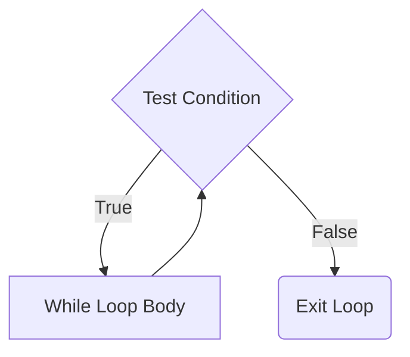

## Syntax
A Boolean expression that determines whether the loop will execute. 
The basic syntax is:

```C++
while(condition is true)
{
    // body of While Loop will execute
}
```

## Key Characteristics
The while loop in C++ continues executing its code block until the specified condition becomes false, making it ideal for tasks that require repetition until a particular goal is achieved or a certain state is reached.

Unlike the for loop, which often relies on a counter variable to dictate a fixed number of iterations, the while loop is more adaptable.

## FlowChart



## Basic Examples

### Example 1: Print from 1 to 5
```cpp
int i = 1;

while(i <= 5)
{
    cout << i << endl;
    i++; // Important: Don't forget to update the loop variable!
}
```

### Example 2: Read Positive Number
```cpp
int Number;
cout << "Please enter a positive number ? \n";
cin >> Number;

while(Number < 0)
{
    cout << "Wrong number, please enter a positive number ? \n";
    cin >> Number;
}

cout << "\n The number you entered is : " << Number << endl;
```

### Example 3: Read Number in a Range (Fixed Version)
```cpp
int ReadIntNumberInRange(int From, int To)
{
    int Number;

    cout << "Please enter a number between " << From << " and " << To << endl;
    cin >> Number;

    while(Number < From || Number > To)
    {
        cout << "Wrong number! ";
        cout << "Please enter a number between " << From << " and " << To << endl;
        cin >> Number;
    }

    return Number;
}
```

## Best Practices and Common Pitfalls

### Avoiding Infinite Loops
A common error where the loop condition is incorrectly written. Forgetting to Update Variables: For example, not incrementing a loop counter.

To avoid infinite loops, it is essential to ensure that the loop's condition will eventually become false. This usually involves updating a variable within the loop body that affects the loop's condition.

**❌ Common Mistake - Infinite Loop:**
```cpp
int i = 1;
while(i < 5)
{
    cout << i << endl;
    // Missing i++ - This creates an infinite loop!
}
```

**✅ Correct Version:**
```cpp
int i = 1;
while(i < 5)
{
    cout << i << endl;
    i++; // Always update the loop control variable
}
```

### Key Guidelines
1. **Always ensure the condition can become false**: Make sure variables used in the condition are modified within the loop
2. **Initialize loop variables properly**: Set appropriate starting values before the loop
3. **Be careful with floating-point comparisons**: Use ranges instead of exact equality
4. **Consider using do-while when you need at least one execution**: The body of do...while loop is executed once before the condition is checked

### Performance Considerations
- While loops are ideal for condition-based repetition rather than counting
- Use for loops when you know the exact number of iterations
- Consider extracting complex while loops into separate functions for better code organization

## Advanced Example: Input Validation with Multiple Conditions
```cpp
#include <iostream>
#include <limits>
using namespace std;

int getValidatedInput(int min, int max) {
    int input;
    
    while(true) {
        cout << "Enter a number between " << min << " and " << max << ": ";
        
        if(!(cin >> input)) {
            // Handle non-numeric input
            cout << "Invalid input! Please enter a number.\n";
            cin.clear();
            cin.ignore(numeric_limits<streamsize>::max(), '\n');
        }
        else if(input >= min && input <= max) {
            break; // Valid input, exit loop
        }
        else {
            cout << "Number out of range! ";
        }
    }
    
    return input;
}
```

## Summary
While loops are powerful control structures that provide flexibility for condition-based iteration. Always remember to:
- Update loop control variables
- Ensure termination conditions are reachable
- Handle edge cases and invalid inputs
- Use appropriate loop types for different scenarios