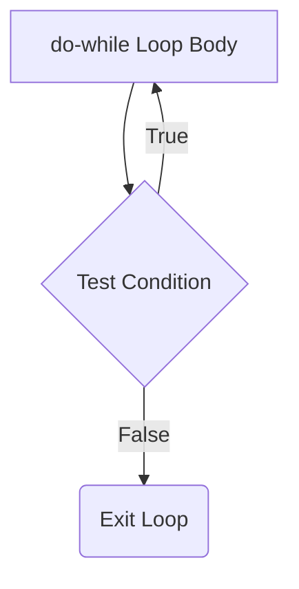

#### **The do-while loop**
shines when you need the code to execute at least once regardless of conditions. Unlike a regular while loop, the do-while loop executes the body first and then checks the condition, guaranteeing at least one execution.

## Key Characteristic
In while loop body is executed after the given condition is evaluated, whereas in the do-while loop, the loop body is executed, and then the given condition is checked.

---

## Syntax

```C++
do 
{
    // do-while body executes at least once
    // statements to execute
}
while (condition);  // Note: semicolon is required!
```

**Important**: Don't forget the semicolon (`;`) after the while condition - it's mandatory for do-while loops!

---

## FlowChart



---

## Key Differences: do-while vs while

| Aspect | while Loop | do-while Loop |
|--------|------------|---------------|
| **Condition Check** | Before execution | After execution |
| **Minimum Executions** | 0 (may not execute at all) | 1 (always executes at least once) |
| **Syntax** | `while(condition) { ... }` | `do { ... } while(condition);` |
| **Use Case** | When condition must be true to start | When body must execute at least once |

---

## When to Use Do-While Loops

Here are some practical scenarios where do-while loops are ideal:

1. **User Input Validation** - Prompt users to enter data until valid input is received
2. **Menu Navigation** - Display menus where users need to see options at least once
3. **Game Loops** - Main game loops that must run at least one iteration
4. **Interactive Programs** - Any scenario requiring guaranteed initial execution

---

## Examples

### Basic Example
```cpp
int i = 6;
do 
{
    cout << "This will print once, even though i > 5" << endl;
    cout << "Current value: " << i << endl;
    i++;
}
while (i <= 5);

// Output: "This will print once, even though i > 5"
//         "Current value: 6"
```

### Practical Example: Menu System
```cpp
#include <iostream>
using namespace std;

void displayMenu() {
    int choice;
    
    do {
        cout << "\n=== Main Menu ===" << endl;
        cout << "1. Option 1" << endl;
        cout << "2. Option 2" << endl;
        cout << "3. Exit" << endl;
        cout << "Enter your choice (1-3): ";
        cin >> choice;
        
        switch(choice) {
            case 1:
                cout << "You selected Option 1" << endl;
                break;
            case 2:
                cout << "You selected Option 2" << endl;
                break;
            case 3:
                cout << "Goodbye!" << endl;
                break;
            default:
                cout << "Invalid choice! Please try again." << endl;
        }
    } while(choice != 3);
}
```

### Input Validation Example (Fixed)
```cpp
int ReadIntNumberInRangeUsingDoWhile(int From, int To)
{
    int Number;
    
    do 
    {
        cout << "Please enter a number between " << From << " and " << To << ": ";
        cin >> Number;
        
        if(Number < From || Number > To) {
            cout << "Invalid input! Number must be between " << From 
                 << " and " << To << "." << endl;
        }
        
    } while(Number < From || Number > To);
    
    return Number;
}
```

### Advanced Input Validation with Error Handling
```cpp
#include <iostream>
#include <limits>
using namespace std;

int getValidInteger() {
    int number;
    
    do {
        cout << "Enter a valid integer: ";
        
        if(!(cin >> number)) {
            cout << "Invalid input! Please enter a number." << endl;
            cin.clear(); // Clear error flags
            cin.ignore(numeric_limits<streamsize>::max(), '\n'); // Ignore bad input
        } else {
            break; // Valid input received
        }
    } while(true);
    
    return number;
}
```

---

## Common Pitfalls and Best Practices

### ❌ Common Mistakes
1. **Forgetting the semicolon**: `while(condition)` ← Missing semicolon causes compilation error
2. **Infinite loops**: Not updating variables that affect the condition
3. **Wrong loop choice**: Using do-while when while would be more appropriate

### ✅ Best Practices
1. **Use do-while sparingly**: The C++ Core Guidelines include a recommendation as ES.75: avoid do-statements
2. **Ensure termination**: Always make sure the condition can become false
3. **Clear intent**: Use do-while only when you genuinely need guaranteed execution
4. **Input validation**: Perfect for scenarios requiring at least one user interaction

---

## Performance Considerations

Do-while loops have the same performance characteristics as while loops. The choice between them should be based on logic requirements, not performance:

- Use **while** when the condition should be checked before any execution
- Use **do-while** when you need guaranteed first execution
- Consider readability and maintainability in your choice

---

## Alternative Approaches

Sometimes you can rewrite do-while loops for better clarity:

```cpp
// Do-while approach
do {
    processInput();
} while(needMoreInput());

// Alternative while approach
processInput();
while(needMoreInput()) {
    processInput();
}
```

Choose the approach that makes your code's intent clearest to future readers.

---

## Summary

The do-while loop is a specialized control structure that guarantees at least one execution of its body. While less commonly used than while loops, it's invaluable for scenarios like user input validation, menu systems, and interactive programs where initial execution is mandatory. Remember to use it judiciously and always include the required semicolon after the condition.