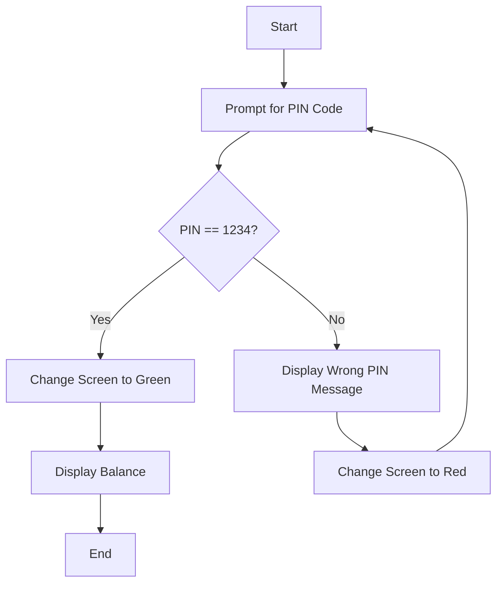

# ATM PIN Code Authentication System

## Problem Statement
Create an ATM PIN code authentication system that:
- Prompts the user to enter a PIN code
- Validates the entered PIN against a stored PIN (1234)
- Provides visual feedback for correct/incorrect attempts
- Allows multiple attempts until correct PIN is entered
- Displays account balance upon successful authentication

---

# Algorithm Analysis

## High-Level Algorithm
1. **Initialize**: Set the correct PIN code (1234)
2. **Authentication Loop**:
   - Prompt user for PIN input
   - Compare entered PIN with stored PIN
   - If correct: grant access and show balance
   - If incorrect: display error and change screen color to red
   - Repeat until correct PIN is entered
3. **Success**: Change screen to green and display balance

## Flowchart


---

# Step-by-Step Solution Breakdown

## Step 1: Function to Read PIN Code
```cpp
string ReadPinCode()
{
    string PinCode;
    
    cout << "Please enter PIN Code: ";
    cin >> PinCode;
    
    return PinCode;
}
```

**Purpose**: 
- Encapsulates PIN input functionality
- Returns the entered PIN as a string
- Provides clear user prompt

## Step 2: Login Authentication Function
```cpp
bool Login()
{
    string PinCode;
    const string CORRECT_PIN = "1234"; // Use constant for better practice
    
    do
    {
        PinCode = ReadPinCode();
        
        if (PinCode == CORRECT_PIN)
        {
            return true; // Successful authentication
        }
        else
        {
            cout << "\nWrong PIN! Please try again." << endl;
            system("color 4F"); // Red background, white text
        }
        
    } while (PinCode != CORRECT_PIN);
    
    return false; // This line is never reached but good practice
}
```

**Logic Explanation**:
- Uses a `do-while` loop to ensure at least one attempt
- Compares entered PIN with correct PIN (1234)
- Returns `true` immediately upon correct PIN
- Changes console color to red for visual feedback on wrong PIN
- Continues looping until correct PIN is entered

## Step 3: Main Function - Program Entry Point
```cpp
int main()
{
    cout << "=== Welcome to ATM System ===" << endl;
    
    if (Login())
    {
        system("color 2F"); // Green background, white text
        cout << "\nAccess Granted!" << endl;
        cout << "Your Balance = 20000 Dh" << endl;
    }
    
    return 0;
}
```

**Main Logic**:
- Calls the `Login()` function
- If login succeeds (returns `true`):
  - Changes screen to green (success indication)
  - Displays account balance

---

# Original Solution

```c++
#include <iostream>
#include <string>
using namespace std;
 
string ReadPinCode()
{
	string PinCode;

	cout << "Please enter PIN Code :" << endl;
	cin >> PinCode;

	return PinCode;
 }

bool Login()
{
	string PinCode;

	do
	{
		PinCode = ReadPinCode();

		if (PinCode == "1234")
		{
			return 1; // this will exit the function and return true
		}
		else
		{
			cout << "\n Wrong PIN" << endl;
			system("color 4F"); // turn the screen red:
		}

	} while (PinCode != "1234");

	return 0; // when you reach here this means login fail
}

int main()
{

	if (Login())
	{
		system("color 2F"); // turn screen green
		cout << "\nYour Balance = " << 20000 << " Dh" << endl;
	}


	return 0;
}
```

---

# Enhanced Solution with Improvements

```cpp
#include <iostream>
#include <string>
#include <limits>
using namespace std;

// Function to read PIN code from user
string ReadPinCode()
{
    string PinCode;
    
    cout << "Please enter your 4-digit PIN Code: ";
    cin >> PinCode;
    
    return PinCode;
}

// Function to validate PIN and handle authentication
bool Login()
{
    string PinCode;
    const string CORRECT_PIN = "1234"; // Correct PIN
    int attempts = 0;
    const int MAX_ATTEMPTS = 3; // Maximum allowed attempts
    
    cout << "\n=== ATM PIN Authentication ===" << endl;
    
    do
    {
        PinCode = ReadPinCode();
        attempts++;
        
        if (PinCode == CORRECT_PIN)
        {
            cout << "\n✓ PIN Correct!" << endl;
            return true; // Successful login
        }
        else
        {
            cout << "\n✗ Wrong PIN!" << endl;
            cout << "Attempts remaining: " << (MAX_ATTEMPTS - attempts) << endl;
            
            if (attempts < MAX_ATTEMPTS)
            {
                system("color 4F"); // Red screen for wrong PIN
                cout << "Please try again." << endl;
            }
            else
            {
                cout << "Maximum attempts reached. Access denied." << endl;
                system("color 4F"); // Keep red screen
                return false; // Failed login after max attempts
            }
        }
        
    } while (PinCode != CORRECT_PIN && attempts < MAX_ATTEMPTS);
    
    return false; // Should not reach here
}

int main()
{
    cout << "=== Welcome to Secure ATM System ===" << endl;
    
    if (Login())
    {
        system("color 2F"); // Green screen for success
        cout << "\n" << string(40, '=') << endl;
        cout << "    ACCESS GRANTED - WELCOME!" << endl;
        cout << string(40, '=') << endl;
        cout << "Account Balance: 20,000.00 Dh" << endl;
        cout << string(40, '=') << endl;
    }
    else
    {
        cout << "\nAccess denied. Please contact your bank." << endl;
    }
    
    // Reset console color
    system("color 07");
    return 0;
}
```

---

# Key Programming Concepts

## 1. **Control Structures**
- **do-while loop**: Ensures at least one execution
- **if-else statements**: Conditional logic for PIN validation
- **Boolean returns**: Success/failure indication

## 2. **Function Design**
- **ReadPinCode()**: Single responsibility - handle input
- **Login()**: Authentication logic with validation
- **Separation of concerns**: Each function has one clear purpose

## 3. **String Handling**
- Using `string` type for PIN storage
- String comparison with == operator
- User-friendly input prompts

## 4. **User Experience**
- Visual feedback with console colors
- Clear success/error messages
- Professional formatting

---

# Algorithm Complexity

## Time Complexity
- **Best Case**: O(1) - Correct PIN on first attempt
- **Worst Case**: O(∞) - User never enters correct PIN (infinite loop)
- **With max attempts**: O(k) where k is maximum attempts

## Space Complexity
- **O(1)**: Constant space usage
- Only stores PIN strings and counters

---

# Possible Enhancements

## Security Features
1. **Attempt Limiting**: Maximum 3 attempts before lockout
2. **PIN Encryption**: Don't store PIN in plain text
3. **Session Timeout**: Auto-logout after inactivity
4. **Account Locking**: Temporary account suspension

## Additional Features
1. **Multiple Accounts**: Support different users
2. **Transaction Options**: Withdraw, deposit, transfer
3. **PIN Change**: Allow users to update PIN
4. **Transaction History**: Display recent activities

## Code Improvements
1. **Input Validation**: Check PIN format (4 digits)
2. **Error Handling**: Handle non-string input
3. **Configuration**: Load settings from file
4. **Logging**: Record authentication attempts

---

# Learning Outcomes

This project demonstrates:
- **Loop Design**: Effective use of do-while loops
- **Function Decomposition**: Breaking problems into smaller parts
- **Boolean Logic**: Using true/false returns for status
- **User Interface**: Creating engaging console applications
- **Security Basics**: Simple authentication mechanisms
- **Code Organization**: Clean, readable code structure

The ATM PIN code system is an excellent introduction to authentication systems and demonstrates how simple programming concepts can create practical, real-world applications.