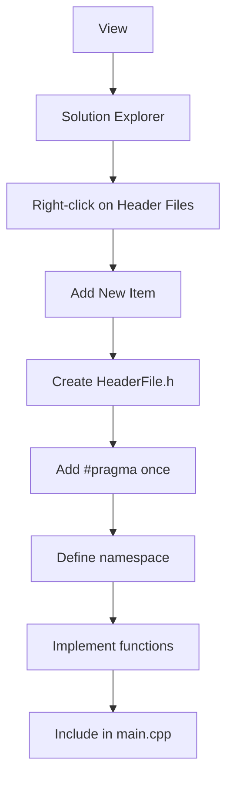

## Overview
Creating custom libraries in C++ allows you to organize and reuse code effectively. This guide covers the basics of creating header-only libraries using proper practices.

## Project Setup Process



## Basic Implementation Example

### Main Application (main.cpp)
```cpp
#include <iostream>
#include "MyFirstLib.h" // Include our custom library
using namespace std;

int main()
{
    MyLib::Test(); // Call function from our library
    
    // Example of using multiple functions
    MyLib::DisplayMessage("Hello from main!");
    int result = MyLib::Add(5, 3);
    cout << "5 + 3 = " << result << endl;
    
    return 0;
}
```

### Library Header File (MyFirstLib.h)
```cpp
#pragma once  // Modern include guard - prevents multiple inclusions

#include <iostream>
#include <string>

namespace MyLib  // Namespace prevents naming conflicts
{
    // Function declarations
    void Test();
    void DisplayMessage(const std::string& message);
    int Add(int a, int b);
    
    // Inline function implementation (for header-only library)
    inline void Test() 
    {
        std::cout << "Hi this is my first Lib!" << std::endl;
    }
    
    inline void DisplayMessage(const std::string& message)
    {
        std::cout << "Library says: " << message << std::endl;
    }
    
    inline int Add(int a, int b)
    {
        return a + b;
    }
}
```

## Best Practices

### 1. Include Guards
Always use include guards to prevent multiple inclusions. Modern compilers support `#pragma once` which is simpler than traditional include guards.

**Traditional Include Guard:**
```cpp
#ifndef MYLIBRARY_H
#define MYLIBRARY_H
// Your code here
#endif // MYLIBRARY_H
```

**Modern Approach:**
```cpp
#pragma once
// Your code here
```

### 2. Namespace Usage
Always wrap your library code in a namespace to prevent naming conflicts:

```cpp
namespace MyLibraryName 
{
    // All library functions and classes here
}
```

### 3. Header-Only vs Separate Implementation

**Header-Only Library (Recommended for simple libraries):**
- All code in the header file
- Use `inline` keyword for functions
- Easy to distribute and use
- Header-only libraries require no separate compilation step

**Separate Implementation:**
```cpp
// MyLib.h (Declaration)
#pragma once
namespace MyLib 
{
    void Test();
    int Add(int a, int b);
}

// MyLib.cpp (Implementation)
#include "MyLib.h"
#include <iostream>

void MyLib::Test() 
{
    std::cout << "Hi this is my first Lib!" << std::endl;
}

int MyLib::Add(int a, int b) 
{
    return a + b;
}
```

### 4. Const-Correctness and Parameters
```cpp
namespace MyLib 
{
    // Use const references for string parameters
    void DisplayMessage(const std::string& message);
    
    // Use const for functions that don't modify state
    int Calculate(int a, int b) const;
    
    // Return const references when appropriate
    const std::string& GetLibraryName();
}
```

## Advanced Library Structure

### Template Functions
```cpp
#pragma once
#include <iostream>

namespace MyLib 
{
    template<typename T>
    T Maximum(const T& a, const T& b) 
    {
        return (a > b) ? a : b;
    }
    
    template<typename T>
    void Print(const T& value) 
    {
        std::cout << "Value: " << value << std::endl;
    }
}
```

### Class-Based Library
```cpp
#pragma once
#include <string>
#include <vector>

namespace MyLib 
{
    class Calculator 
    {
    private:
        std::vector<double> history;
        
    public:
        double Add(double a, double b);
        double Subtract(double a, double b);
        double Multiply(double a, double b);
        double Divide(double a, double b);
        
        void ShowHistory() const;
        void ClearHistory();
    };
    
    // Inline implementation for header-only
    inline double Calculator::Add(double a, double b) 
    {
        double result = a + b;
        history.push_back(result);
        return result;
    }
    
    // ... other implementations
}
```

## Key Points to Remember

1. **Include Dependencies**: Include only the headers that are required for your header file to work
2. **Avoid `using namespace std`** in header files to prevent namespace pollution
3. **Use `std::`** prefix explicitly in header files
4. **Document your library** with comments explaining function purposes and parameters
5. **Test thoroughly** before distributing your library
6. Code files should include their paired header file to allow the compiler to catch errors at compile time

## Common Pitfalls to Avoid

- Not using include guards (causes multiple definition errors)
- Using `using namespace std` in headers
- Not using `const` references for large objects
- Poor namespace organization
- Missing documentation
- Not testing the library independently

This approach creates maintainable, reusable code that follows C++ best practices and modern standards.


---

## VS Code Specific Setup for C++ Libraries

### Important Differences from Visual Studio

The method described above works primarily for **Visual Studio** (the full IDE), but **VS Code** requires additional configuration since it's a lightweight editor that needs explicit setup for C++ compilation and library management.

### VS Code Project Structure for Custom Libraries

For VS Code, you need to set up a proper directory structure and configuration files:

```
project/
├── .vscode/
│   ├── tasks.json          # Build configuration
│   ├── launch.json         # Debug configuration
│   └── c_cpp_properties.json  # IntelliSense configuration
├── bin/                    # Compiled executables
├── include/               # Header files (.h/.hpp)
├── src/                   # Source files (.cpp)
├── Makefile              # Build script
└── main.cpp              # Main application
```

### Step-by-Step VS Code Setup

#### 1. Install Required Extensions
- Install the **C/C++** extension by Microsoft from the VS Code marketplace

#### 2. Create Configuration Files

**Makefile** (for building the project):
```makefile
CXX := g++
CXX_FLAGS := -std=c++17 -ggdb
BIN := bin
SRC := src
INCLUDE := include
LIBRARIES :=
EXECUTABLE := main

all: $(BIN)/$(EXECUTABLE)

run: clean all
	clear
	./$(BIN)/$(EXECUTABLE)

$(BIN)/$(EXECUTABLE): $(SRC)/*.cpp
	$(CXX) $(CXX_FLAGS) -I$(INCLUDE) $^ -o $@ $(LIBRARIES)

clean:
	-rm $(BIN)/*
```

**tasks.json** (Build task configuration):
```json
{
    "version": "2.0.0",
    "tasks": [
        {
            "label": "build",
            "type": "shell",
            "command": "make",
            "group": {
                "kind": "build",
                "isDefault": true
            },
            "problemMatcher": "$gcc"
        }
    ]
}
```

**c_cpp_properties.json** (IntelliSense configuration):
```json
{
    "configurations": [
        {
            "name": "Linux",
            "includePath": [
                "${workspaceFolder}/**",
                "${workspaceFolder}/include"
            ],
            "defines": [],
            "compilerPath": "/usr/bin/g++",
            "cStandard": "c17",
            "cppStandard": "c++17",
            "intelliSenseMode": "linux-gcc-x64"
        }
    ],
    "version": 4
}
```

**launch.json** (Debug configuration):
```json
{
    "version": "0.2.0",
    "configurations": [
        {
            "name": "(gdb) Launch",
            "type": "cppdbg",
            "request": "launch",
            "program": "${workspaceFolder}/bin/main",
            "args": [],
            "stopAtEntry": false,
            "cwd": "${workspaceFolder}",
            "environment": [],
            "externalConsole": false,
            "MIMode": "gdb",
            "preLaunchTask": "build",
            "setupCommands": [
                {
                    "description": "Enable pretty-printing for gdb",
                    "text": "-enable-pretty-printing",
                    "ignoreFailures": true
                }
            ]
        }
    ]
}
```

### Example Library Implementation for VS Code

**include/MyLibrary.hpp:**
```cpp
#pragma once
#include <iostream>
#include <string>

namespace MyLib 
{
    void Test();
    void DisplayMessage(const std::string& message);
    int Add(int a, int b);
}
```

**src/MyLibrary.cpp:**
```cpp
#include "MyLibrary.hpp"

namespace MyLib 
{
    void Test() 
    {
        std::cout << "Hi this is my first Lib in VS Code!" << std::endl;
    }
    
    void DisplayMessage(const std::string& message)
    {
        std::cout << "Library says: " << message << std::endl;
    }
    
    int Add(int a, int b)
    {
        return a + b;
    }
}
```

**src/main.cpp:**
```cpp
#include "MyLibrary.hpp"

int main()
{
    MyLib::Test();
    MyLib::DisplayMessage("Hello from VS Code!");
    
    int result = MyLib::Add(10, 5);
    std::cout << "10 + 5 = " << result << std::endl;
    
    return 0;
}
```

### Key VS Code Differences

1. **No Solution Explorer**: VS Code requires explicit path configuration in both `c_cpp_properties.json` for IntelliSense and `tasks.json` for compilation

2. **Manual Build Setup**: Unlike Visual Studio's automatic project management, VS Code requires:
   - Manual Makefile creation or build system setup
   - Explicit include path configuration
   - Custom tasks.json configuration to tell VS Code how to build the program

3. **Separate Configuration Files**: 
   - tasks.json and c_cpp_properties.json are completely separate with no interaction between them
   - Both need to be configured with the same include paths

4. **Build Process**: Use `Ctrl+Shift+B` to build instead of right-clicking in Solution Explorer

5. **Debugging**: Press `F5` to debug (automatically builds first if `preLaunchTask` is configured)

### Platform-Specific Notes

**Windows Users**: 
- Install MinGW-w64 or Visual Studio Build Tools
- Start VS Code from a developer command prompt to ensure proper environment setup
- Update compiler paths in configurations accordingly

**Linux/macOS Users**: 
- Install GCC/Clang development tools
- Install build-essential package on Ubuntu: `sudo apt install build-essential gdb`

### Building and Running

1. **Build**: Press `Ctrl+Shift+B` or run `make` in terminal
2. **Run**: Execute `./bin/main` in terminal or use the configured launch task
3. **Debug**: Press `F5` to start debugging with breakpoints

This VS Code setup provides the same functionality as Visual Studio but requires more manual configuration. The benefit is greater control over the build process and cross-platform compatibility.