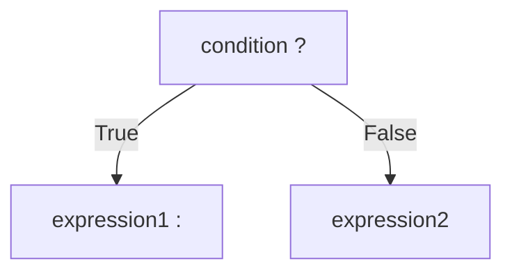

## Ternary Operator (Conditional Operator)

The ternary operator, also known as the conditional operator, is a concise way to write simple if-else statements in C++. It evaluates to one of two values based on a Boolean expression and is the only operator in C++ that takes three operands.

### Syntax



**General Form:**
```cpp
 result = (condition) ? expression_if_true : expression_if_false;
```

### Basic Example

```cpp
#include<iostream>
using namespace std;

int main()
{
	int Mark = 90;
	string result;

	//Using normal if
	if (Mark >= 50)
	{
		result = "PASS";
	}
	else
	{
		result = "FAIL";
	}
	cout << result << endl;

	//Using Short Hand IF (Ternary Operator)
	result = (Mark >= 50) ? "PASS" : "FAIL";
	cout << result << endl;

	return 0;
}
```

### Advantages

The ternary operator can make code more concise and readable by reducing the number of lines and brackets. It's particularly useful for:
- Simple conditional assignments
- Inline conditional expressions
- Reducing code verbosity for straightforward conditions

### When to Use

Use the ternary operator for simple conditions and stick to if-else for complex logic. Best practices include:
- ✅ Use for simple, single-line conditional assignments
- ✅ Use when the condition and results are easy to understand
- ❌ Avoid for complex or lengthy expressions
- ❌ The ternary operator should only be used for short conditional code

### Best Practices and Warnings

**About Nested Ternary Operators:**
It is not recommended to use nested ternary operators because it makes code more complex. Complicated expressions should generally avoid use of the conditional operator, as they tend to be error prone and hard to read.

**Readability Considerations:**
While the ternary operator can improve code readability in certain cases, excessive use or complex expressions can reduce code maintainability.

### Homework 1 - Solution
**Problem:** Check if a number is positive or negative

```cpp
#include<iostream>
using namespace std;

int main()
{
	int Number = 1;
	string Result;

	Result = (Number > 0) ? "Positive" : "Negative";
	cout << "Number is " << Result << endl;

	return 0;
}
```

### Homework 2 - Solution
**Problem:** Check if a number is zero, positive, or negative (Nested Ternary)

```cpp
#include<iostream>
using namespace std;

int main()
{
	int Number = 0;
	string Result;

	// Nested ternary operator (Note: Not recommended for complex conditions)
	Result = (Number == 0) ? "Zero" : ((Number > 0) ? "Positive" : "Negative");

	cout << "Number is " << Result;

	return 0;
}
```

**Note:** While this example demonstrates nested ternary operators, for better readability in production code, an if-else-if chain would be preferred for this scenario.

### Additional Examples

**Finding Maximum of Two Numbers:**
```cpp
int a = 10, b = 20;
int max = (a > b) ? a : b;
cout << "Maximum is: " << max << endl;
```

**Setting Default Values:**
```cpp
string username = inputName.empty() ? "Guest" : inputName;
```

### Key Takeaways

1. The ternary operator is a shorthand for simple if-else statements
2. It returns a value, making it useful for assignments
3. Keep it simple - complex conditions should use traditional if-else
4. Avoid nesting ternary operators for better code maintainability
5. Code clarity should always take priority over brevity