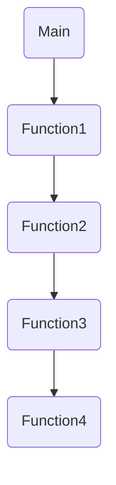

## **1. Call Stack**

The **call stack** is a stack data structure that stores information about the active subroutines and inline blocks of a computer program. It's also known as an **execution stack**, **program stack**, **control stack**, or **run-time stack**.

### **How It Works**

- Every time a function is called, a **stack frame** is pushed onto the stack.
- When the function finishes, its frame is **popped** from the stack.
- It operates in a Last-In-First-Out (LIFO) manner, meaning the last function called is the first one to complete and exit.
- The stack helps the program remember **where to return** after a function call.

### **What's Stored in a Stack Frame?**

A function in C needs memory for the following components:
- **Function Arguments**: Values passed to the function
- **Local Variables**: Variables declared inside the function
- **Return Address**: Where to continue execution after the function completes
- **Saved Register Values**: CPU register states that need to be preserved

```ad-example
**Call Stack Flow:**

- `main()` called → push `main`
- `funcA()` called → push `funcA`
- `funcB()` called → push `funcB`
- `funcC()` called → push `funcC`
- `funcC()` finishes → pop `funcC`
- `funcB()` finishes → pop `funcB`
- `funcA()` finishes → pop `funcA`
- `main()` finishes → pop `main`
```

### **Stack Overflow**

When a program attempts to use more space than is available, the stack can overflow, typically resulting in a program crash. The most common cause of stack overflow is excessively deep or infinite recursion, in which a function calls itself so many times that the space needed to store the variables and information exceeds the available stack space.

```ad-warning
**Common Causes of Stack Overflow:**
- Infinite or excessively deep recursion
- Very large local arrays or variables
- Too many nested function calls
- Missing base case in recursive functions
```

## **2. Call Hierarchy

The **call hierarchy** shows **which functions call which other functions** in a program.

- It's like a **tree view** of function calls.
- Helps you understand **dependencies** and program flow.
- Allows you to trace the execution path of your program.

```ad-example
**Simple Call Hierarchy:**

main()
 └── funcA()
      └── funcB()
           └── funcC()
```

## **3. Practical Example in C++**

```cpp
#include <iostream>
using namespace std;

void Function4()
{
	cout << "Hi I'm function4 " << endl;
}

void Function3()
{
	Function4();
}

void Function2()
{
	Function3();
}

void Function1()
{
	Function2();
}

int main() 
{
	Function1();
	return 0;
}
```

### **Inside the Stack:**



### **Stack Unwinding:**

When the program ends, the stack clears all the functions starting with the last one:
1. **Function4** completes → pop from stack
2. **Function3** completes → pop from stack
3. **Function2** completes → pop from stack
4. **Function1** completes → pop from stack
5. **Main** completes → pop from stack
6. Program exits

```ad-info
**Key Concept**: When a script calls a function, the interpreter adds it to the call stack and then starts carrying out the function. Any functions that are called by that function are added to the call stack further up, and run where their calls are reached.
```

## **4. Debugging with Call Stack**

The call stack is extremely useful for debugging:
- Most debuggers show you the current call stack
- You can see the sequence of function calls that led to a particular point
- Helps identify the path of execution when an error occurs
- Essential for understanding stack traces in error messages

```ad-tip
**Pro Tip**: When debugging, always check the call stack to understand how your program reached the current execution point. This is especially helpful when dealing with complex nested function calls or recursive algorithms.
```
