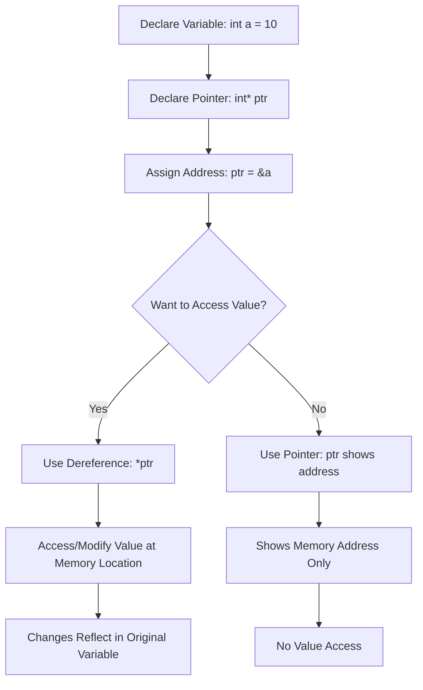

# Dereferencing Pointer in C++

## What is Dereferencing?

**Dereferencing** a pointer means accessing (or modifying) the actual value stored at the memory address that the pointer holds. Referencing a value indirectly via a pointer is called indirection or dereferencing. In C++, we use the **`*` operator** (dereference operator) for this purpose.

## Memory Visualization

```
Memory Layout Example:
┌─────────────────────────────────────────────────────────┐
│  Variable 'a'     │   Pointer 'ptr'                     │
│  Address: 1000    │   Address: 2000                     │
│  Value: 10        │   Value: 1000 (points to 'a')       │
└─────────────────────────────────────────────────────────┘

When we dereference 'ptr' using *ptr:
*ptr → follows address 1000 → retrieves value 10
```

## Basic Example with Step-by-Step Analysis

```cpp
#include <iostream>
using namespace std;

int main()
{
    int a = 10;
    cout << "a value = " << a << endl;           // Output: 10
    cout << "a address = " << &a << endl;        // Output: memory address (e.g., 0x1000)

    int* pointer;
    pointer = &a;    // pointer now holds the address of 'a'

    cout << "Pointer Value = " << pointer << endl;              // Address of 'a'
    cout << "Dereferenced Value = " << *pointer << endl;        // 10

    // Modifying value through dereferencing
    *pointer = 20;   // Changes the value at address 'a'
    cout << a << endl;        // 20 (original variable changed)
    cout << *pointer << endl; // 20

    // Changing original variable
    a = 30;
    cout << a << endl;        // 30
    cout << *pointer << endl; // 30 (pointer still points to same address)

    return 0;
}
```

## Flowchart: Pointer Dereferencing Process



## Types of Dereferencing Operations

### 1. **Read Operation**
```c++
int value = 42;
int* ptr = &value;
cout << *ptr;  // Reads the value (42) from memory
```

### 2. **Write Operation**
```cpp
int value = 42;
int* ptr = &value;
*ptr = 100;    // Writes new value (100) to memory
// Now value == 100
```

## ⚠️ Critical Safety Considerations

### 1. **Uninitialized Pointer Dereferencing**
```cpp
// ❌ DANGEROUS - Undefined Behavior
int *p; 
*p = 10; // p points to random memory location
```

### 2. **Null Pointer Dereferencing**
Always check for null pointers before dereferencing them:

```cpp
// ❌ DANGEROUS - Runtime Error/Crash
int *p = nullptr;
cout << *p; // Undefined behavior - program crash

// ✅ SAFE - Check before dereferencing
int *p = nullptr;
if (p != nullptr) {
    cout << *p;
} else {
    cout << "Pointer is null!" << endl;
}
```

### 3. **Dangling Pointer Dereferencing**
Reset pointers to null after they have been deleted:

```cpp
int* ptr = new int(42);
delete ptr;        // Memory is freed
ptr = nullptr;     // ✅ Good practice - prevent dangling pointer
// *ptr would now be caught by null check instead of accessing invalid memory
```

## Best Practices for Safe Dereferencing

Following best practices like initializing pointers, checking for NULL before dereferencing, and using smart pointers can help safely navigate pointer complexities:

### 1. **Always Initialize Pointers**
```cpp
// ✅ Good practices
int* ptr = nullptr;        // Initialize to nullptr
int* ptr = &someVariable;  // Initialize to valid address
```

### 2. **Check Before Dereferencing**
```cpp
void safeDeref(int* ptr) {
    if (ptr != nullptr) {
        cout << "Value: " << *ptr << endl;
    } else {
        cout << "Error: Null pointer!" << endl;
    }
}
```

### 3. **Use Modern C++ Features**
Use smart pointers to manage memory automatically and reduce risks:

```cpp
#include <memory>

// Smart pointers automatically manage memory
std::unique_ptr<int> smartPtr = std::make_unique<int>(42);
cout << *smartPtr << endl;  // Safe dereferencing
// No need to manually delete - automatic cleanup
```

## Memory Diagram: Before and After Dereferencing

```
Before Assignment (*ptr = 20):
┌──────────────┐    ┌──────────────┐
│   Variable   │    │   Pointer    │
│   a = 10     │◄───┤ ptr = &a     │
│ Addr: 1000   │    │ Addr: 2000   │
└──────────────┘    └──────────────┘

After Assignment (*ptr = 20):
┌──────────────┐    ┌──────────────┐
│   Variable   │    │   Pointer    │
│   a = 20     │◄───┤ ptr = &a     │
│ Addr: 1000   │    │ Addr: 2000   │
└──────────────┘    └──────────────┘
```

## Common Dereferencing Errors and Solutions

| Error Type | Problem | Solution |
|------------|---------|----------|
| **Segmentation Fault** | Dereferencing uninitialized pointer | Always initialize pointers |
| **Access Violation** | Dereferencing null pointer | Check for nullptr before use |
| **Memory Corruption** | Dereferencing dangling pointer | Set to nullptr after delete |
| **Buffer Overflow** | Array bound violations | Use proper bounds checking |

## Summary

- **Dereferencing** uses the `*` operator to access the value at a pointer's address
- The `*ptr` expression dereferences the pointer, giving access to the value it points to
- Always ensure pointers are valid before dereferencing
- Modern C++ provides smart pointers for safer memory management
- Follow safety practices to prevent crashes and undefined behavior

Understanding pointer dereferencing is crucial for effective C++ programming and memory management.