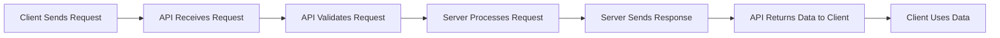

## **Definition

An <span style="color:rgb(20, 192, 255)">API</span> (<span style="color:rgb(20, 192, 255)">A</span>pplication <span style="color:rgb(20, 192, 255)">P</span>rogramming <span style="color:rgb(20, 192, 255)">I</span>nterface) is a connection between computers or between computer programs that acts as a software interface, offering services to other pieces of software. Think of it as a messenger that takes requests, tells a system what you want to do, and returns the response back to you.

---

## 🍽️ The Restaurant Analogy

Imagine you're at a restaurant:

```
┌─────────────┐         ┌─────────────┐         ┌─────────────┐
│             │         │             │         │             │
│    YOU      │ ───────▶│   WAITER    │ ───────▶│   KITCHEN   │
│  (Client)   │         │    (API)    │         │  (Server)   │
│             │         │             │         │             │
└─────────────┘         └─────────────┘         └─────────────┘
      │                       │                       │
      │                       │                       │
      │                       │                  Prepares food
      │                  Delivers                     │
      │                  request                      │
      │                       │                       │
      │◀──────────────────────┴───────────────────────┘
      │             Returns your meal
      │
   Enjoys food
```

You (the client) ask the waiter (the API) for a meal. The waiter delivers your request to the kitchen (the server). The kitchen prepares your order and gives it back to the waiter, who brings it to your table. You never need to enter the kitchen yourself!

---

## 🔑 Key Concepts

### What Makes an API?

An <span style="color:rgb(20, 192, 255)">API</span> is a set of rules or protocols that enables software applications to communicate with each other to exchange data, features and functionality.

**Two Main Components:**
1. **Specification** - The rules defining how information is exchanged
2. **Implementation** - The actual software written to follow those rules

### Client-Server Model

```
CLIENT                          SERVER
(Makes request)                 (Provides response)
     │                               │
     │   1. Request (HTTP)           │
     ├──────────────────────────────▶│
     │                               │
     │   2. Process request          │
     │                               ├──┐
     │                               │◀─┘
     │                               │
     │   3. Response (JSON/XML)      │
     │◀──────────────────────────────┤
     │                               │
```

---

##  Why Use APIs?

### Benefits

✅ **Save Time & Effort**
*Instead of writing complex code from scratch, developers can call APIs that already provide the functions they need.

✅ **Enable Integration**
*Building software using APIs has been compared to using building-block toys, such as Lego bricks - they may be joined together via their APIs, composing a new software product.

✅ **Hide Complexity**
*A well-designed API exposes only objects or actions needed by software or software developers and hides details that have no use.

✅ **Security & Control**
*APIs enable the sharing of small packets of data, relevant to the specific request. They keep other internal system details hidden, which helps preserve the integrity of system security.

---

##  **How APIs Work

### The Request-Response Cycle

APIs work by sharing data between applications through a request and response cycle:



### Anatomy of an API Request

An API request typically includes the following components:

1. **Endpoint** - A dedicated URL that provides access to a specific resource
   - Example: `https://api.weather.com/forecast`

2. **Parameters** - Variables passed to provide specific instructions
   - Example: `?city=London&days=7`

3. **Request Headers** - Extra details like authentication credentials
   - Example: `Authorization: Bearer abc123xyz`

4. **Request Body** - The main data being sent (for creating/updating)
   - Example: `{"temperature": 72, "conditions": "sunny"}`

---

## 📊 Types of APIs

### By Access Level

```
┌─────────────────────────────────────────────────┐
│  PRIVATE/INTERNAL APIs                          │
│  • Only for internal company use                │
│  • Maximum control and security                 │
└─────────────────────────────────────────────────┘

┌─────────────────────────────────────────────────┐
│  PARTNER APIs                                   │
│  • Shared with specific business partners       │
│  • Requires agreement/authentication            │
└─────────────────────────────────────────────────┘

┌─────────────────────────────────────────────────┐
│  PUBLIC/OPEN APIs                               │
│  • Available to any third-party developers      │
│  • May be free or commercial                    │
└─────────────────────────────────────────────────┘
```

### By Architecture Type

APIs follow specific protocols that define how data is exchanged:

| Type | Description | Use Case |
|------|-------------|----------|
| **REST** | Uses standard HTTP methods (GET, POST, PUT, DELETE) | Most common, web services |
| **SOAP** | XML-based, strict protocol | Enterprise applications |
| **GraphQL** | Query language for APIs | Flexible data retrieval |
| **RPC** | Remote procedure calls | Executing functions remotely |

---

## 🌟 Real-World Examples

### 1. Weather App
```
Your App ──[API Request]──▶ Weather Service
         ◀─[Temperature, Forecast]── 
```
If a developer wants to display a weather report, they can use an API to get the data instead of creating the entire system to gather weather data themselves.

### 2. Social Media Login
A popular API example is the function that enables people to log in to websites by using their Facebook, X, or Google profile login details.

```
E-commerce Site ──[Login with Google]──▶ Google API
                ◀─[User verified]────── 
```

### 3. Payment Processing
```
Shopping Cart ──[Payment Details]──▶ Payment Gateway API
             ◀─[Payment confirmed]── 
```

### 4. Maps Integration
Your app can display Google Maps without building your own mapping system.

---

## 🔐 API Security

### Authentication Methods

**API Keys**
- Simple identifier for the application
- Like a unique password for your app
- Good for monitoring usage

**Authentication Tokens**
- Verify the user's identity
- More secure than API keys
- Check access rights for each request

```
┌──────────────┐
│ Your Request │
└──────┬───────┘
       │
       ├─ API Key: xyz789
       ├─ Token: Bearer abc123
       │
       ▼
┌──────────────┐
│ API Gateway  │ ─── Validates credentials
└──────┬───────┘
       │
       ▼
┌──────────────┐
│    Server    │
└──────────────┘
```

---

##  **Key Takeaways

1. **APIs are messengers** - They allow different software to communicate without knowing how each other works internally

2. **Request-Response Pattern** - Client asks, server responds, API facilitates the conversation

3. **Building Blocks** - APIs let you combine existing services instead of building everything from scratch

4. **Universal Usage** - APIs are everywhere—working continuously in the background to power the digital experiences that are essential to our modern lives

5. **Standard Protocols** - Most modern web APIs use REST architecture with HTTP methods


**Key Terms to Remember:**
- **Endpoint**: The URL where the API can be accessed
- **Request**: What you send to the API
- **Response**: What the API sends back to you
- **Client**: The application making the request
- **Server**: The application providing the response
- **JSON/XML**: Common data formats for API responses

---

*Remember: APIs are like contracts between software - they define how programs can talk to each other in a standardized, reliable way!*