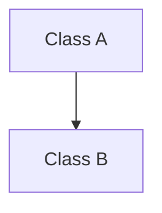
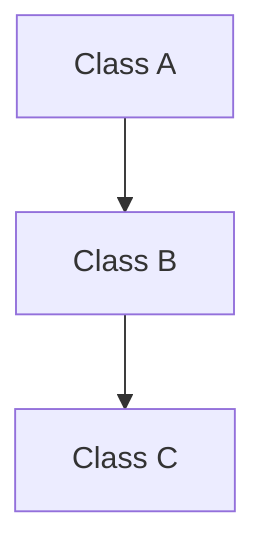
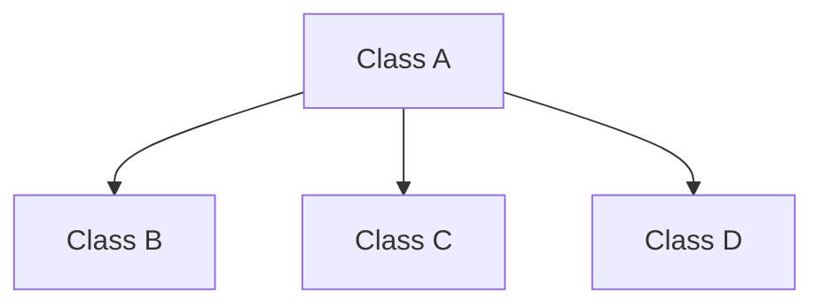
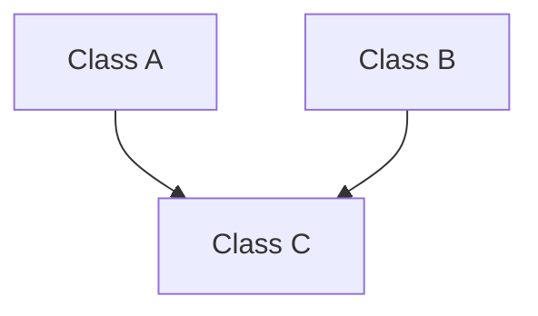
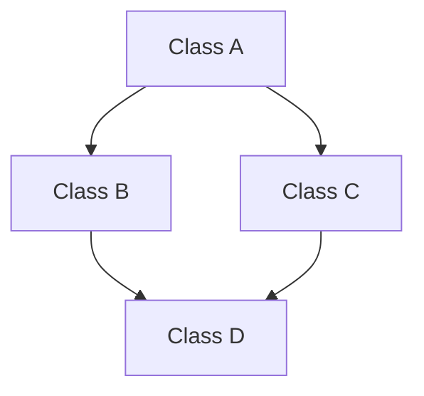

#### 1. Single Inheritance : 

Class A inherit Class B.

#### 2. Multilevel Inheritance : 

- Class C inherit Class B
- Class B inherit Class A 
- so automatically Class C inherit Class A 

#### 3. Hierarchical Inheritance : 

- Classes B, C & D inherit Class A

#### Type that exist only in C++ : 

#### 1. Multiple Inheritance : 

- Class C inherit Class A & B 
- this type of inheritance need a lot of focus because they cause problem 
- like if we have a function named ( **Print()** ) in both Class A and Class B and we Override the function inside the Class C it will causes problems.

#### 2. Hybrid : 

- ### Problem:

Class `D` will inherit **two copies of `A`** (ambiguity problem).  

