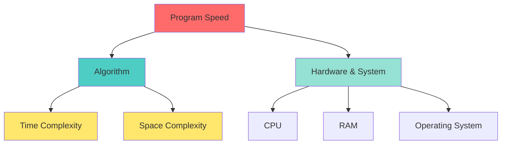
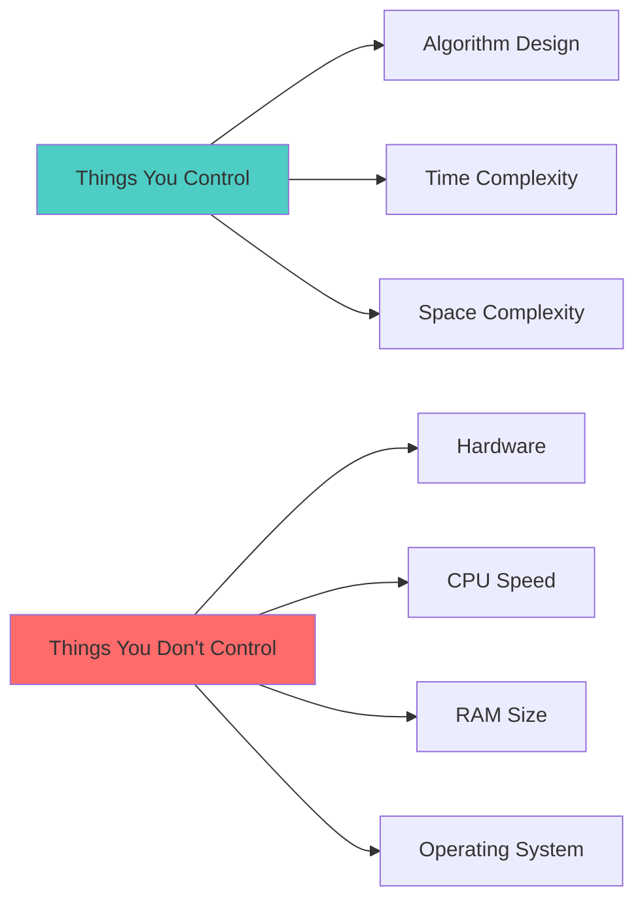
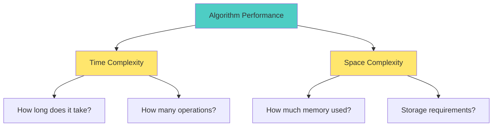
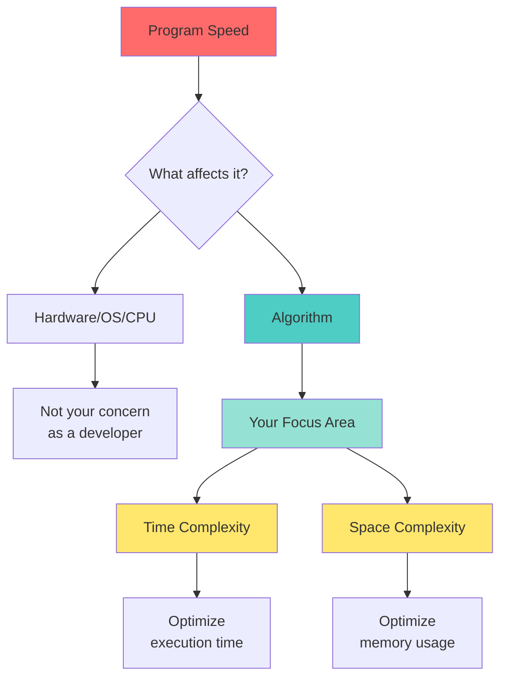
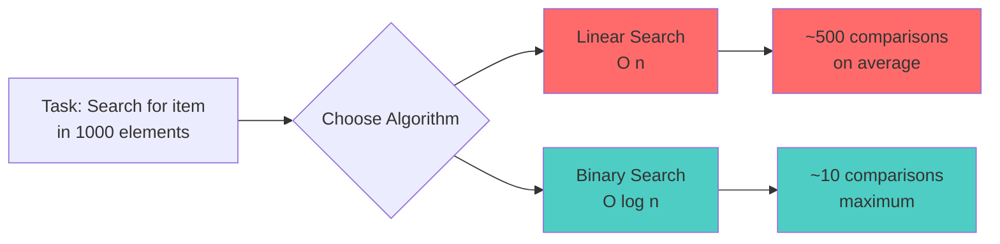

Understanding what impacts your program's performance is crucial for writing efficient code. Let's break down the key factors that determine how fast your program runs.

## Main Factors Affecting Program Speed

## What Should You Focus On?

### 🎯 The Developer's Responsibility

### Key Principle
> **Focus on what you can control: THE ALGORITHM**

**Example:**
- Printing an array of 100 items will be faster on a faster computer
- But that's not your problem as a developer!
- Your job is to write the most efficient algorithm possible

## Algorithm Performance Breakdown

### Time Complexity
- **What it measures:** How execution time grows with input size
- **Why it matters:** Determines if your program is fast or slow
- **Examples:**
  - O(1) - Constant time (very fast)
  - O(n) - Linear time (scales with input)
  - O(n²) - Quadratic time (gets slow quickly)

### Space Complexity
- **What it measures:** How much memory your algorithm uses
- **Why it matters:** Affects whether your program can handle large datasets
- **Trade-off:** Sometimes you can use more memory to make things faster

## The Complete Picture

## Practical Takeaways

### ✅ What to Do
1. **Focus on Algorithm Design**
   - Choose the right data structure
   - Use efficient algorithms
   - Understand time and space complexity

2. **Analyze Your Code**
   - How many operations does it perform?
   - How does it scale with larger inputs?
   - How much memory does it need?

3. **Optimize Where It Matters**
   - Profile your code to find bottlenecks
   - Don't prematurely optimize
   - Balance time vs space trade-offs

### ❌ What Not to Worry About (Initially)
- The user's hardware specs
- Operating system differences
- CPU clock speeds
- RAM size (within reason)

## Real-World Example

**The Point:** Your algorithm choice matters far more than whether the user has a fast or slow computer!

## Summary

| Factor | Your Control | Impact on Speed | What to Do |
|--------|--------------|-----------------|------------|
| **Algorithm** | ✅ Full control | 🔥 Huge impact | Study & optimize |
| **Time Complexity** | ✅ Full control | 🔥 Huge impact | Choose efficient approach |
| **Space Complexity** | ✅ Full control | 🔥 Significant impact | Balance with time |
| **Hardware** | ❌ No control | ⚡ Fixed multiplier | Don't worry about it |
| **OS/CPU** | ❌ No control | ⚡ Fixed multiplier | Not your problem |

---

## Key Concept
**As a developer, your power lies in writing efficient algorithms. The hardware will do what it does, but a good algorithm will be fast everywhere, and a bad algorithm will be slow everywhere!**

