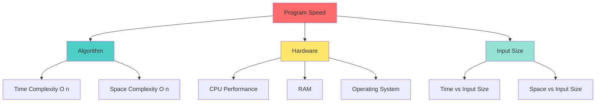
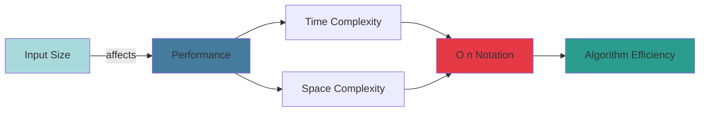

## What is Big O Notation?

Big O notation is a mathematical way to describe how the **performance** of an algorithm changes as the **input size** grows. *Think of it as a way to measure the efficiency of your code. 

> **"Order Of"** - Originally stands for "Order Of", representing the efficiency of an algorithm.

### Key Points to Remember:
- 🎯 Represents an algorithm's **worst-case complexity**
- 📈 Shows the **relationship between input size and performance**
- ⚖️ Measures both **time** (speed) and **space** (memory) efficiency
- 🔢 Written as **O(n)** where n is the number of inputs

---

## ⚠️ What Big O is NOT

Big O notation does **NOT**:
- ❌ Give you the exact time a piece of code will take to run
- ❌ Consider hardware performance (CPU, RAM, OS)
- ❌ Measure actual seconds or milliseconds
- ❌ Account for your computer's processing power

Instead, it gives you a **relative comparison** of how algorithms scale.

---

## 🕐 Time Complexity

**Time Complexity** specifies how long it will take to execute an algorithm as a function of its input size.

### Simple Example:
```
Printing Array[10] items is FASTER than Printing Array[1000] items
```

*The time it takes grows with the input size!

---

## 💾 Space Complexity

**Space Complexity** specifies the total amount of space or memory required to execute an algorithm as a function of the input size.

Think of it as: *How much memory does my algorithm need as the data grows?*

---

## 🎯 Factors Affecting Program Speed



---

## 📐 Understanding Big O with Algebraic Terms

Big O uses **algebraic expressions** to describe complexity:

| Notation | Name | Description |
|----------|------|-------------|
| O(1) | Constant | Same time regardless of input size |
| O(log n) | Logarithmic | Increases slowly as input grows |
| O(n) | Linear | Time grows directly with input |
| O(n log n) | Linearithmic | Common in efficient sorting |
| O(n²) | Quadratic | Time grows with square of input |
| O(2ⁿ) | Exponential | Doubles with each addition to input |
| O(n!) | Factorial | Extremely slow, grows very quickly |

---

## 🎓 The Big Picture



### How Big O Helps Us:
1. **Compare Algorithms** - Which solution is more efficient?
2. **Predict Scalability** - Will this work with 1 million records?
3. **Optimize Code** - Where should we focus our improvements?
4. **Make Trade-offs** - Balance between time and space complexity

---

##  Real-World Analogy

Imagine you need to find a book in a library:

- **O(1)** - You know the exact shelf location (constant time)
- **O(log n)** - You use the library catalog system (logarithmic)
- **O(n)** - You check each shelf one by one (linear)
- **O(n²)** - You check each shelf, and for each shelf, check every book twice (quadratic)

As the library grows (more input), which method scales better?

---

## 🔑 Key Takeaways

1. Big O describes **how algorithms scale** with input size
2. It focuses on the **worst-case scenario**
3. We care about **growth rate**, not exact timing
4. Both **time and space** can be analyzed with Big O
5. Choose algorithms based on your **specific needs** (speed vs memory)

---

*Remember: Big O is about understanding how your code performs as data grows, not about measuring exact execution time!* ⏱️

---

