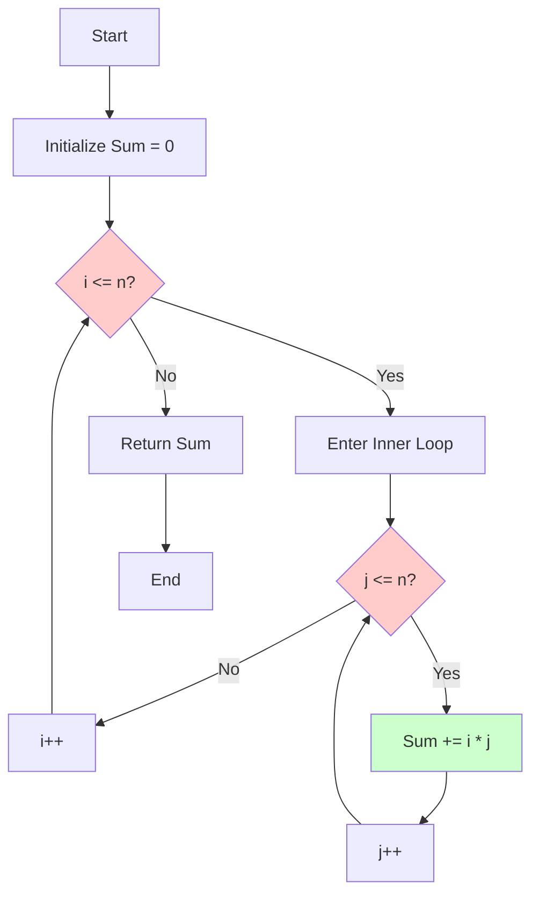

## 📊 What is O(n²)?

**O(n²)** represents **Quadratic Time Complexity**, where the algorithm's execution time grows proportionally to the **square** of the input size. This happens most commonly when you have **nested loops** that both iterate through the entire input.

> **Simple Definition:** If your input doubles, your execution time quadruples!

---

## 🎯 Real-World Analogy

Imagine you're organizing a handshake event:
- With 10 people, you need **100 handshakes** (each person shakes hands with all 10)
- With 20 people, you need **400 handshakes** (doubled people = 4x handshakes!)
- With 100 people, you need **10,000 handshakes** 

This is quadratic growth! 📈

---

## 📈 Growth Visualization

```
Input (n) | Operations (n²) | Time Impact
----------|----------------|-------------
1         | 1              | instant
10        | 100            | fast
100       | 10,000         | noticeable
1,000     | 1,000,000      | slow ⚠️
10,000    | 100,000,000    | very slow 🐌
```


---

## 💻 Classic Example: Nested Loops

### The Code

```cpp
int MultiplicationSum(short n)
{
    int Sum = 0;                        // 1 step
    
    for (int i = 1; i <= n; i++)       // n iterations
    {
        for (int j = 1; j <= n; j++)   // n iterations (for each i)
        {
            Sum = Sum + (i * j);       // 1 step
        }
    }
    
    return Sum;                         // 1 step
}
```

### 🔍 Step-by-Step Analysis

**What happens when n = 3?**

```
Outer Loop (i):
  i=1: Inner loop runs 3 times → j=1, j=2, j=3
  i=2: Inner loop runs 3 times → j=1, j=2, j=3
  i=3: Inner loop runs 3 times → j=1, j=2, j=3

Total inner loop executions = 3 × 3 = 9 = n²
```

**What happens when n = 10?**
- Outer loop: 10 iterations
- Inner loop: 10 iterations × 10 times = **100 operations**

**What happens when n = 100?**
- Total operations = 100 × 100 = **10,000 operations**

---

## 🧮 Mathematical Breakdown

```
Number of steps outside loops = 4
Number of steps inside inner loop = 5

Total complexity calculation:
= 4 + (n × n × 5)
= 4 + 5n²
= 5n² + 4

In Big O notation, we drop constants and lower terms:
Big O = O(n²)
```

### Why Drop Constants?

Because for large values of n:
- When n = 1,000: `5n² = 5,000,000` vs `4` is negligible
- When n = 10,000: `5n² = 500,000,000` vs `4` is meaningless

**The dominant factor is n²!**

---

## 🎨 Flowchart: How Nested Loops Work



---

## ⚡ Common O(n²) Scenarios

### 1. **Nested Loops** (Most Common)
```cpp
for (int i = 0; i < n; i++) {
    for (int j = 0; j < n; j++) {
        // O(n²) operation
    }
}
```

### 2. **Bubble Sort**
```cpp
for (int i = 0; i < n; i++) {
    for (int j = 0; j < n-1; j++) {
        if (arr[j] > arr[j+1])
            swap(arr[j], arr[j+1]);
    }
}
```

### 3. **Selection Sort**
```cpp
for (int i = 0; i < n-1; i++) {
    for (int j = i+1; j < n; j++) {
        if (arr[j] < arr[min])
            min = j;
    }
}
```

### 4. **Checking for Duplicates (Naive Approach)**
```cpp
for (int i = 0; i < n; i++) {
    for (int j = i+1; j < n; j++) {
        if (arr[i] == arr[j])
            return true;
    }
}
```

---

## 📊 Performance Comparison Table

| Algorithm Type | Time Complexity | Performance for n=1000 |
|----------------|-----------------|------------------------|
| O(1) - Constant | Same always | 1 operation |
| O(n) - Linear | Grows linearly | 1,000 operations |
| **O(n²) - Quadratic** | **Grows squared** | **1,000,000 operations** ⚠️ |
| O(n³) - Cubic | Grows cubed | 1,000,000,000 operations 🐌 |

---

## ⚠️ When to Avoid O(n²)

**Avoid O(n²) algorithms when:**
- ❌ Working with large datasets (n > 10,000)
- ❌ Performance is critical
- ❌ Real-time processing is needed
- ❌ You're processing user input on-the-fly

**O(n²) is acceptable when:**
- ✅ Dataset is small (n < 100)
- ✅ Simplicity is more important than performance
- ✅ It's a one-time operation
- ✅ No better algorithm exists for your specific case

---

## 🚀 How to Optimize O(n²) Algorithms

### Strategy 1: Use Better Data Structures
**Before (O(n²)):**
```cpp
// Check if element exists
for (int i = 0; i < n; i++) {
    for (int j = 0; j < n; j++) {
        if (arr1[i] == arr2[j])
            return true;
    }
}
```

**After (O(n)):**
```cpp
// Use hash set
unordered_set<int> set(arr1, arr1 + n);
for (int i = 0; i < n; i++) {
    if (set.find(arr2[i]) != set.end())
        return true;
}
```

### Strategy 2: Use Sorting + Two Pointers
**Before:** Check all pairs → O(n²)
**After:** Sort + use two pointers → O(n log n)

### Strategy 3: Divide and Conquer
**Before:** Compare all elements → O(n²)
**After:** Use merge sort or binary search → O(n log n)

---

## 🎯 Key Takeaways

1. **O(n²) means nested loops** iterating through the input
2. **Performance degrades quickly** as input size grows
3. **Acceptable for small inputs** (n < 100)
4. **Look for optimization opportunities** with better algorithms or data structures
5. **Always consider the problem size** before choosing an algorithm

---

## 🔗 Quick Reference

| Complexity | Name | Example | Performance |
|------------|------|---------|-------------|
| O(1) | Constant | Array access | Excellent ⭐⭐⭐⭐⭐ |
| O(log n) | Logarithmic | Binary search | Great ⭐⭐⭐⭐ |
| O(n) | Linear | Simple loop | Good ⭐⭐⭐ |
| **O(n²)** | **Quadratic** | **Nested loops** | **Fair ⭐⭐** |
| O(2ⁿ) | Exponential | Fibonacci (naive) | Poor ⭐ |

---

*Remember: Understanding time complexity helps you write efficient code that scales well with larger inputs!* 🚀