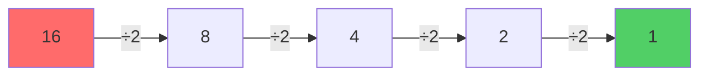
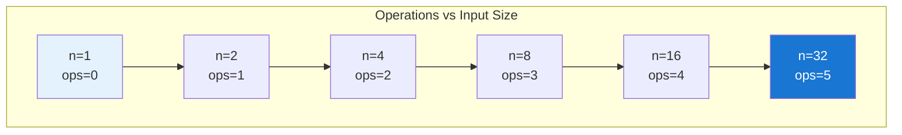
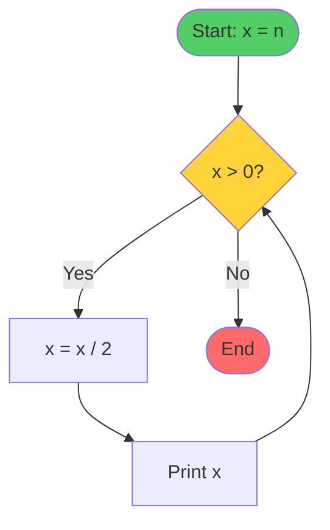
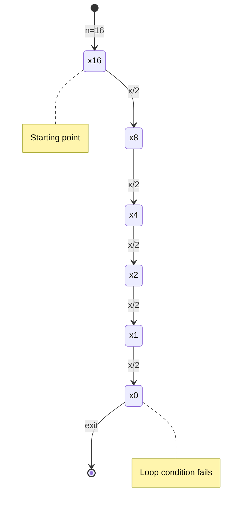

**O(log n)** describes algorithms whose execution time grows **logarithmically** with input size. This is one of the most efficient time complexities after O(1).

> **Key Insight**: As input doubles, operations increase by only +1

---

## 🔢 Understanding Logarithms

### What is a Logarithm?

A logarithm answers the question: **"How many times must we divide n by 2 to get 1?"**

```
log₂(8) = 3     → 8 ÷ 2 ÷ 2 ÷ 2 = 1
log₂(16) = 4    → 16 ÷ 2 ÷ 2 ÷ 2 ÷ 2 = 1
log₂(32) = 5    → 32 ÷ 2 ÷ 2 ÷ 2 ÷ 2 ÷ 2 = 1
```

### Visual Representation



**Steps needed**: 4 operations for n=16

---

## 📈 Growth Rate Comparison

| Input Size (n) | O(1) | O(log n) | O(n) | O(n²) |
|----------------|------|----------|------|-------|
| 1              | 1    | 0        | 1    | 1     |
| 10             | 1    | 3        | 10   | 100   |
| 100            | 1    | 6        | 100  | 10,000|
| 1,000          | 1    | 10       | 1,000| 1M    |
| 1,000,000      | 1    | 20       | 1M   | 1T    |

### Growth Visualization



**Notice**: Input doubles, but operations only increase by 1!

---

## 💻 Code Example Analysis

### Simple Division Loop

```cpp
void fun1(short n)
{
    short x = n;
    while (x > 0)
    {
        x = x / 2;
        cout << x << endl;
    }
}
```

### Complexity Calculation



**Breakdown**:
- **Outside loop**: 1 step (initialization)
- **Inside loop**: 7 steps per iteration
- **Number of iterations**: log₂(n)

**Big O Calculation**:
```
Total Steps = 1 + (7 × log n)
            = 1 + 7 log n
            ≈ log n  (drop constants)
            
Therefore: O(log n)
```

---

## 🎯 Real-World Examples

### 1. Binary Search

Searching in a sorted array by repeatedly dividing the search space:

```cpp
int binarySearch(int arr[], int size, int target) {
    int left = 0, right = size - 1;
    
    while (left <= right) {
        int mid = left + (right - left) / 2;
        
        if (arr[mid] == target)
            return mid;
        else if (arr[mid] < target)
            left = mid + 1;
        else
            right = mid - 1;
    }
    return -1;
}
```

**Why O(log n)?** Each comparison eliminates half of the remaining elements.

### 2. Finding Power of 2

```cpp
bool isPowerOfTwo(int n) {
    while (n > 1) {
        if (n % 2 != 0)
            return false;
        n = n / 2;  // Halving each time
    }
    return n == 1;
}
```

### 3. Phone Book Search

Looking up a name in a phone book:
- Start in the middle
- Go to first or second half based on name
- Repeat until found

---

## 🔍 Step-by-Step Example

### Example: fun1(16)

```
Iteration 1: x = 16/2 = 8    ✓
Iteration 2: x = 8/2  = 4    ✓
Iteration 3: x = 4/2  = 2    ✓
Iteration 4: x = 2/2  = 1    ✓
Iteration 5: x = 1/2  = 0    → Loop exits

Total iterations: 5 = log₂(16) + 1
```

### Trace Diagram



---

## ⚡ Why O(log n) is Efficient

### Comparison with Linear Time

| Algorithm Type | Input: 1M items | Operations |
|---------------|-----------------|------------|
| O(n) - Linear | 1,000,000      | 1,000,000  |
| O(log n) - Log| 1,000,000      | **20**     |

**Efficiency**: Log is **50,000× faster** for large datasets!

---

## 🎓 Key Characteristics

### ✅ Properties
- **Dividing work**: Problem size reduces by fraction each step
- **Very efficient**: Second-best after O(1)
- **Common in**: Binary search, tree operations, divide-and-conquer

### 🔑 Recognition Patterns

You likely have O(log n) when:
1. ✓ Input is divided in half repeatedly
2. ✓ Using binary search approach
3. ✓ Traversing balanced binary trees
4. ✓ Loop variable multiplies/divides by constant

---

## 📝 Quick Reference

### Formula Summary
```
Operations = log₂(n)

Where:
- n = input size
- log₂ = logarithm base 2
- Each iteration cuts problem in half
```

### Complexity Hierarchy
```
Fastest ⚡ → Slowest 🐌

O(1) < O(log n) < O(n) < O(n log n) < O(n²) < O(2ⁿ)
     ← You are here
```

---

## 💡 Tips for Identification

1. **Look for halving**: Variable divided by 2 (or multiplied/divided by constant)
2. **Check loop condition**: Does it eliminate half the problem?
3. **Binary patterns**: Anything "binary" usually hints at log complexity
4. **Tree height**: Balanced tree operations are often O(log n)


---

## 📚 Summary

> **O(log n)** means efficiency scales beautifully with size. Doubling input adds just one operation. Perfect for searching, tree operations, and divide-and-conquer algorithms.

**Remember**: When you see repeated division or halving, think logarithmic!

---
