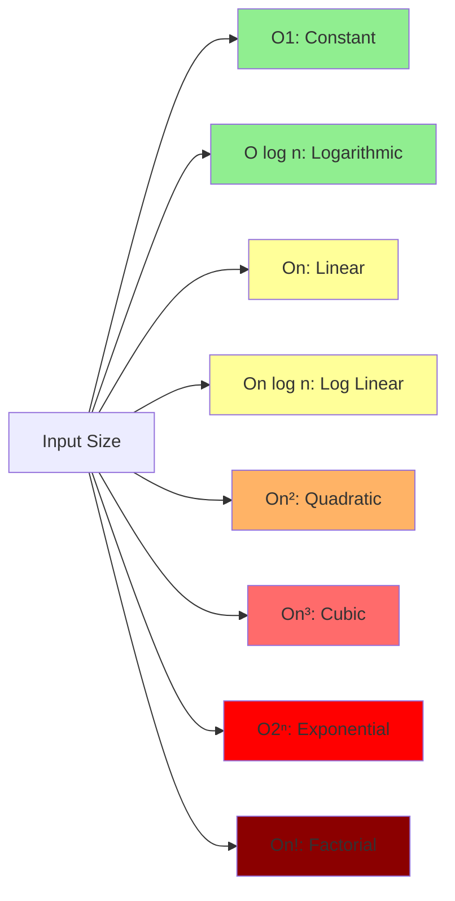
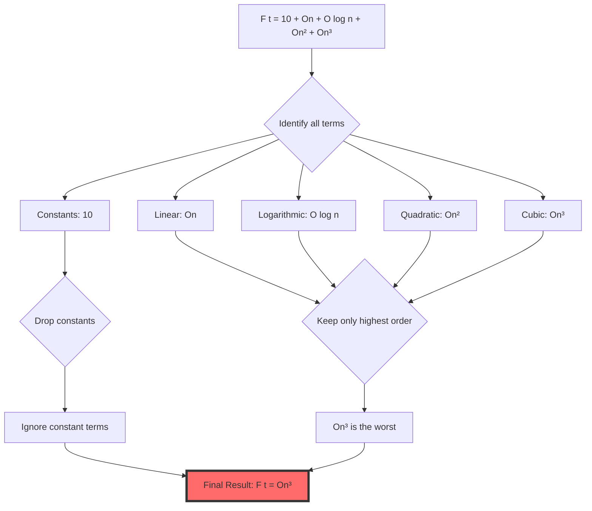
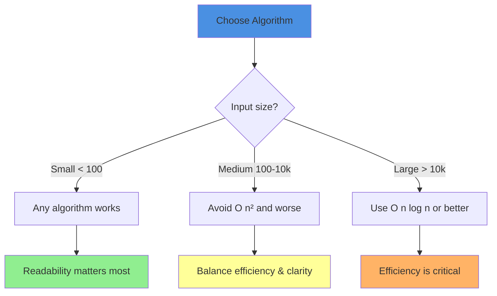
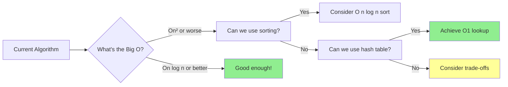

Big O notation helps us compare how different algorithms perform as input size grows. Understanding the relationship between these complexities is crucial for choosing the right algorithm for your problem.

---

## 🎯 Common Big O Complexities (From Best to Worst)

### 1. **O(1) - Constant Time** ⚡
- **Performance**: Excellent - Always the same, regardless of input size
- **Example**: Accessing an array element by index
- **Real-world**: Looking up a value in a hash table

### 2. **O(log n) - Logarithmic Time** 🎯
- **Performance**: Excellent - Grows very slowly
- **Example**: Binary search in a sorted array
- **Real-world**: Searching in a phone book by repeatedly halving the pages

### 3. **O(n) - Linear Time** 📈
- **Performance**: Good - Grows proportionally with input
- **Example**: Finding an element in an unsorted array
- **Real-world**: Reading through a book page by page

### 4. **O(n log n) - Log Linear Time** 📊
- **Performance**: Fair - Efficient for large datasets
- **Example**: Merge sort, Quick sort (average case)
- **Real-world**: Sorting a deck of cards efficiently

### 5. **O(n²) - Quadratic Time** ⚠️
- **Performance**: Poor for large inputs
- **Example**: Bubble sort, nested loops
- **Real-world**: Comparing every student with every other student

### 6. **O(n³) - Cubic Time** 🔴
- **Performance**: Very poor - Impractical for large datasets
- **Example**: Triple nested loops
- **Real-world**: 3D matrix operations

### 7. **O(2ⁿ) - Exponential Time** 💥
- **Performance**: Terrible - Doubles with each added input
- **Example**: Recursive Fibonacci (naive implementation)
- **Real-world**: Trying all password combinations

### 8. **O(n!) - Factorial Time** 🚫
- **Performance**: Worst possible - Exhaustive search
- **Example**: Traveling salesman problem (brute force)
- **Real-world**: Generating all possible arrangements of items

---

## 📈 Growth Rate Visualization



---

## 📊 Performance Comparison Table

| Big O | n=10 | n=100 | n=1,000 | n=10,000 | Performance |
|-------|------|-------|---------|----------|-------------|
| O(1) | 1 | 1 | 1 | 1 | ⭐⭐⭐⭐⭐ |
| O(log n) | 3 | 7 | 10 | 13 | ⭐⭐⭐⭐⭐ |
| O(n) | 10 | 100 | 1,000 | 10,000 | ⭐⭐⭐⭐ |
| O(n log n) | 30 | 700 | 10,000 | 130,000 | ⭐⭐⭐ |
| O(n²) | 100 | 10,000 | 1,000,000 | 100,000,000 | ⭐⭐ |
| O(n³) | 1,000 | 1,000,000 | 1,000,000,000 | 10¹² | ⭐ |
| O(2ⁿ) | 1,024 | 1.27×10³⁰ | Impossible | Impossible | 💀 |
| O(n!) | 3,628,800 | Impossible | Impossible | Impossible | 💀 |

---

## 🎓 The Golden Rule: **Always Take the Worst Big O**

When analyzing complex algorithms with multiple steps, **we only keep the term with the highest growth rate**.

### Example Analysis

```
F(t) = 10 + O(n) + O(log n) + O(n²) + O(n³)
```

**Step-by-step simplification:**



### Why?

```
F(t) = 10 + O(n) + O(log n) + O(n²) + O(n³)

Final Result: F(t) = O(n³)
```

**Reasoning:**
- **Constants (10)** → Ignored (don't grow with input)
- **O(log n)** → Dominated by O(n³)
- **O(n)** → Dominated by O(n³)
- **O(n²)** → Dominated by O(n³)
- **O(n³)** → **This is the bottleneck!**

As n grows large, O(n³) will dwarf all other terms, so it determines the overall performance.

---

## 🎯 Practical Decision Guide



---

## 💡 Key Takeaways

### ✅ Remember These Rules

1. **Drop Constants**: O(2n) → O(n), O(100) → O(1)
2. **Drop Lower Terms**: O(n² + n) → O(n²)
3. **Always Take the Worst**: The highest order term dominates
4. **Different Inputs, Different Variables**: O(n + m) stays as is

### 🎯 Performance Hierarchy (Best → Worst)

```
O(1) < O(log n) < O(n) < O(n log n) < O(n²) < O(n³) < O(2ⁿ) < O(n!)
```

### 🚀 Optimization Strategy



---

## 🔍 Common Mistakes to Avoid

### ❌ Wrong Thinking
```
"O(2n) is twice as slow as O(n)"
```
### ✅ Correct Thinking
```
"O(2n) = O(n) - constants don't matter in Big O"
```

---

### ❌ Wrong Thinking
```
"O(n + 100) is different from O(n)"
```
### ✅ Correct Thinking
```
"O(n + 100) = O(n) - we drop constant terms"
```

---

### ❌ Wrong Thinking
```
"This algorithm is O(n²) + O(n), so it's O(n² + n)"
```
### ✅ Correct Thinking
```
"O(n² + n) = O(n²) - keep only the worst term"
```

---

## 🎓 Real-World Application

### Scenario: Processing User Data

**Task**: Process 1 million user records

| Algorithm | Big O | Time Estimate | Verdict |
|-----------|-------|---------------|---------|
| Hash lookup | O(1) | < 1 second | ✅ Perfect |
| Binary search | O(log n) | < 1 second | ✅ Great |
| Linear scan | O(n) | ~1 second | ✅ Acceptable |
| Sorting | O(n log n) | ~20 seconds | ⚠️ Consider |
| Nested comparison | O(n²) | ~11 days | ❌ Impractical |
| Triple nested loop | O(n³) | ~31,000 years | 💀 Impossible |

---

## 📝 Summary

The complexity of an algorithm is measured by its **worst-case Big O notation**. When combining multiple operations:
- Keep only the **highest order term**
- Drop all **constants and coefficients**
- Focus on **scalability** rather than exact runtime

**Remember**: The best algorithm isn't always the one with the best Big O. Consider:
- Actual input size
- Constant factors (for small inputs)
- Code readability and maintenance
- Memory usage vs. time trade-offs

---

