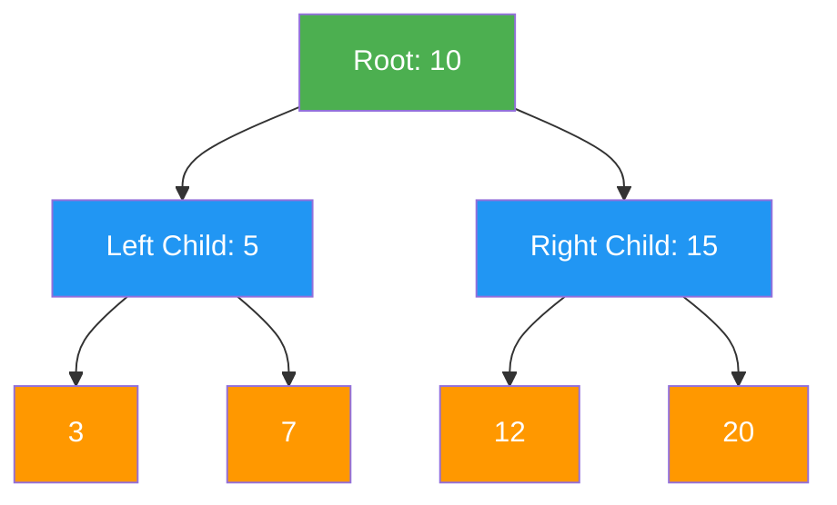
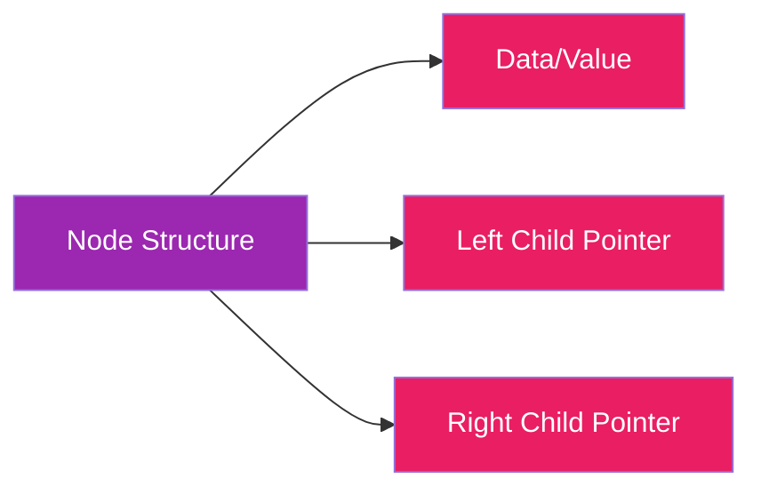
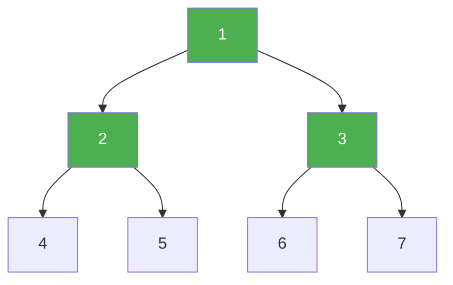
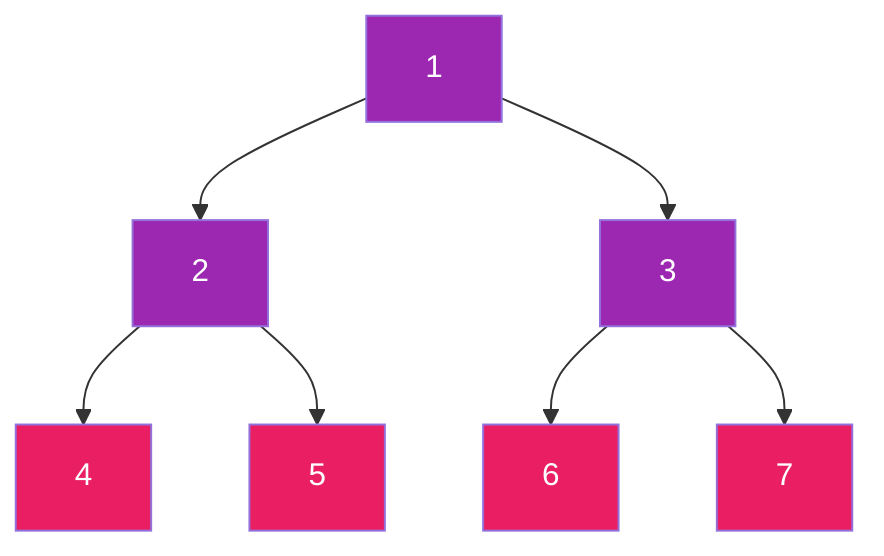
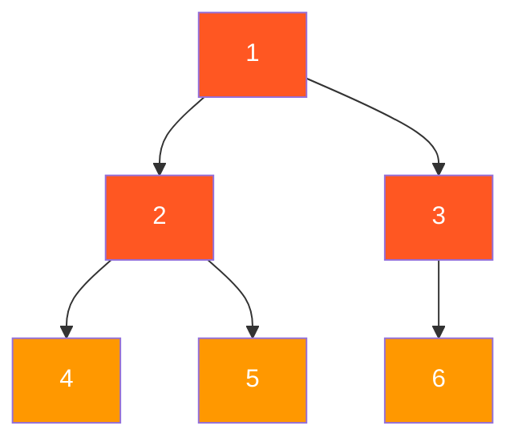
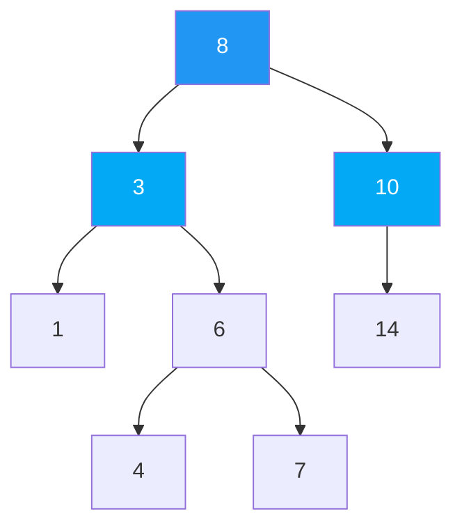
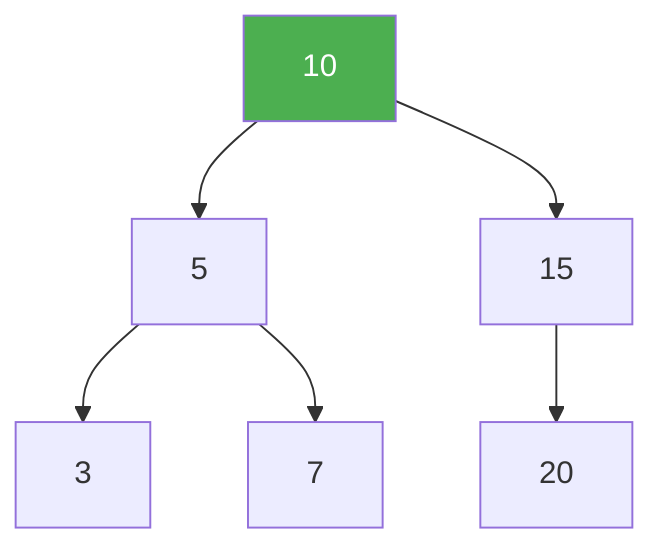
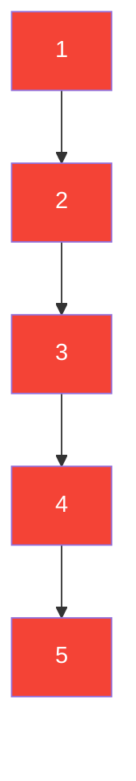
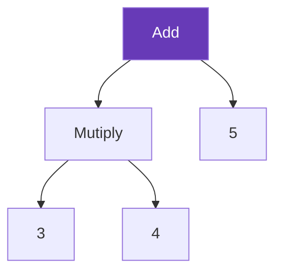
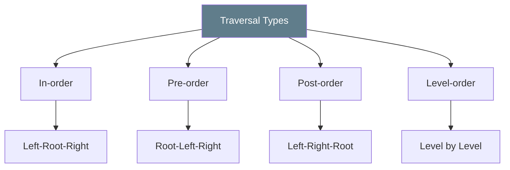

## What is a Binary Tree?

A binary tree is a hierarchical data structure where each node has at most two children, called the left child and the right child. Think of it like a family tree, but each person can have at most two children.

### Visual Representation

---

## Core Concepts

### Key Terminology

- **Root**: The topmost node (where the tree starts)
- **Parent**: A node that has children below it
- **Child**: A node connected below a parent node
- **Leaf**: Nodes at the bottom with no children
- **Height**: The longest path from root to any leaf
- **Level**: The distance from the root (root is at level 0)

### Node Structure

Each node in a binary tree typically contains:
1. **Data** - The value stored in the node
2. **Left pointer** - Reference to the left child
3. **Right pointer** - Reference to the right child

---

## Types of Binary Trees

### 1. Full Binary Tree

A binary tree where each internal node has zero or two children. No node has just one child.

**Characteristics:**
- Every node has 0 or 2 children (never just 1)
- Efficient for certain algorithms
- Clear hierarchical structure

---

### 2. Perfect Binary Tree

A special binary tree where all leaf nodes are at the same level, and each internal node has two children. This is the most "complete" and balanced form.

**Characteristics:**
- All leaf nodes are at the same level
- Maximum number of nodes for a given height
- Highly efficient for operations

---

### 3. Complete Binary Tree

A binary tree where all levels are completely filled except possibly the lowest level, which must have nodes as far left as possible.

**Characteristics:**
- Filled from left to right
- Used in heap implementations
- Efficient for array storage

---

### 4. Binary Search Tree (BST)

A binary tree where for every node, all nodes in its left subtree have values less than the node's value, and all nodes in its right subtree have values greater than the node's value.

**Key Rule:** Left < Parent < Right

**Characteristics:**
- Enables fast search, insert, and delete operations
- Left subtree values are always smaller
- Right subtree values are always larger
- Efficient for searching and sorting

---

### 5. Balanced Binary Tree

A tree where the left and right subtrees of every node differ in height by no more than 1.

**Characteristics:**
- Height difference ≤ 1 for all nodes
- Maintains O(log N) time complexity for operations
- Examples: AVL trees, Red-Black trees

---

### 6. Degenerate (Skewed) Tree

A tree where each internal node has a single child, either left or right. This is essentially a linked list.

**Characteristics:**
- Behaves like a linked list with O(n) search time
- Inefficient for most operations
- Results from unbalanced insertions

---

## Real-World Applications

### 1. File Systems
Binary trees organize directories and files hierarchically, similar to how folders contain subfolders.

### 2. Database Indexing
Binary search trees enable efficient data storage and retrieval in databases.

### 3. Expression Evaluation
Compilers use binary trees to parse and evaluate mathematical expressions.

*Expression: (3 × 4) + 5 = 17*

### 4. Decision Trees
Used in machine learning for classification and prediction tasks.

### 5. Huffman Coding
Binary trees compress data efficiently by assigning shorter codes to more frequent characters.

### 6. Game AI
Representing game states and possible moves in games like chess.

---

## Key Properties

### Height and Nodes
- A binary tree can have a maximum of 2^(h+1) - 1 nodes at level h (if root is level 0)
- Maximum nodes at any level l = 2^l
- Minimum height for n nodes = log₂(n)

### Traversal Methods

Binary trees can be traversed in different orders:

1. **In-order** (Left → Root → Right)
   - For BST, gives sorted order
   
2. **Pre-order** (Root → Left → Right)
   - Used to create a copy of the tree
   
3. **Post-order** (Left → Right → Root)
   - Used to delete the tree

4. **Level-order** (Level by level, left to right)
   - Breadth-first traversal

---

## Summary

Binary data structures are fundamental building blocks in computer science that provide:

✅ **Hierarchical organization** of data  
✅ **Efficient searching** (especially BST)  
✅ **Fast insertion and deletion** (when balanced)  
✅ **Natural representation** of hierarchical relationships  
✅ **Foundation for advanced structures** (heaps, tries, etc.)

### Quick Reference Table

| Type | Max Children | Special Property | Time Complexity |
|------|--------------|-----------------|-----------------|
| Full Binary | 0 or 2 | No single child nodes | - |
| Perfect Binary | Exactly 2 | All leaves at same level | O(log n) |
| Complete Binary | 0-2 | Filled left to right | O(log n) |
| BST | 0-2 | Left < Root < Right | O(log n) avg |
| Balanced | 0-2 | Height diff ≤ 1 | O(log n) |
| Degenerate | 1 | Like linked list | O(n) |

---

