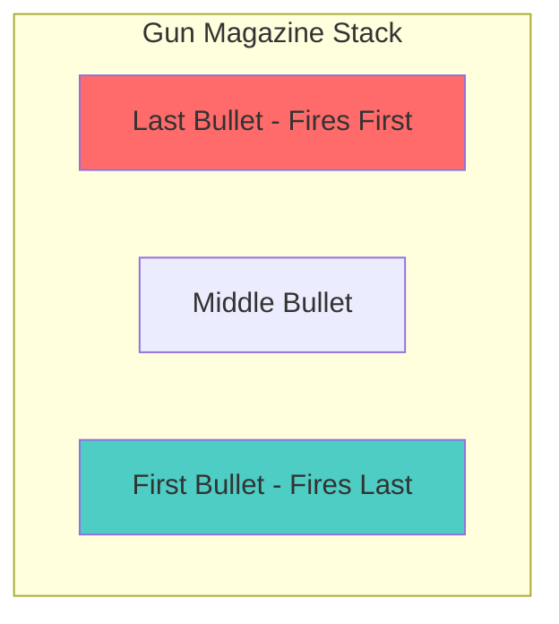
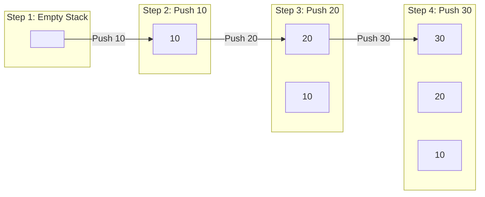
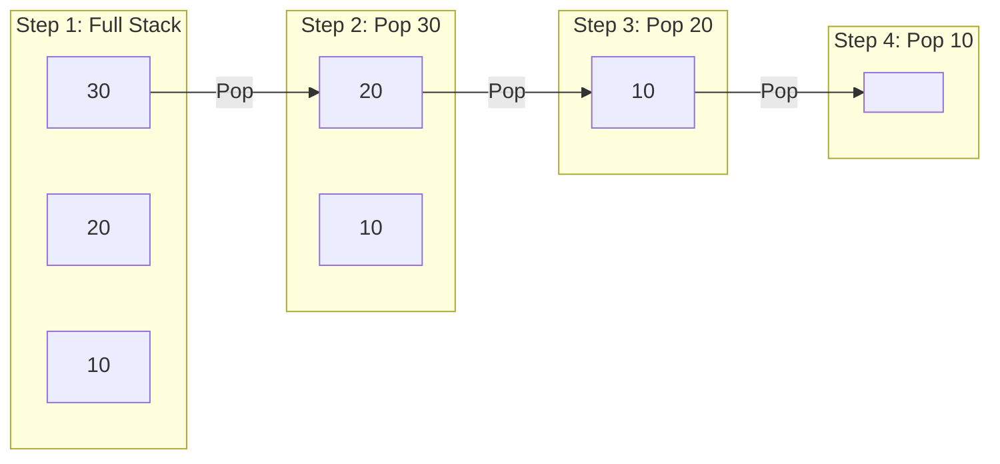

## Overview

A **Stack** is a linear data structure that follows a specific order for operations. Think of it like a stack of plates in a cafeteria - you can only add or remove plates from the top!

## LIFO Principle

Stack operates on the **LIFO** principle:
- `Last In First Out`

The last item you add to the stack is the first one you can remove.

### Real-World Analogy



Just like bullets in a gun magazine - the last bullet loaded is the first one to be fired!

## Basic Stack Operations

### 1. Push Operation

**Push** means adding an element to the top of the stack.



**Example Sequence:**
1. Start with empty stack
2. Push 10 → Stack: `[10]`
3. Push 20 → Stack: `[10, 20]`
4. Push 30 → Stack: `[10, 20, 30]` ← 30 is on top

### 2. Pop Operation

**Pop** means removing the top element from the stack.



**Example Sequence:**
1. Start with stack: `[10, 20, 30]`
2. Pop → Returns 30, Stack: `[10, 20]`
3. Pop → Returns 20, Stack: `[10]`
4. Pop → Returns 10, Stack: `[]` (empty)

## Visual Representation

```
Top of Stack (Most Recent)
    ↓
  [  30  ]  ← Pop removes this first
  [  20  ]
  [  10  ]  ← Push added this first
    ↑
Bottom of Stack (Oldest)
```

## Key Characteristics

| Feature | Description |
|---------|-------------|
| **Access** | Only the top element can be accessed |
| **Insertion** | New elements added only at the top (Push) |
| **Deletion** | Elements removed only from the top (Pop) |
| **Order** | LIFO (Last In, First Out) |

## Common Stack Operations

Besides Push and Pop, stacks typically support:

- **Peek/Top**: View the top element without removing it
- **isEmpty**: Check if the stack is empty
- **Size**: Get the number of elements in the stack

## Use Cases

Stacks are used in many real-world applications:

- **Function Call Management**: Programming languages use stacks to manage function calls
- **Undo/Redo Features**: Text editors use stacks to track changes
- **Browser History**: Back button functionality
- **Expression Evaluation**: Converting and evaluating mathematical expressions
- **Backtracking Algorithms**: Solving mazes, puzzles

## Time Complexity

| Operation | Time Complexity |
|-----------|----------------|
| Push | O(1) - Constant time |
| Pop | O(1) - Constant time |
| Peek | O(1) - Constant time |
| Search | O(n) - Linear time |

## Quick Summary

> A Stack is like a pile of books: you can only add or remove books from the top. The last book you place on the pile is the first one you'll take off (LIFO). This simple principle makes stacks incredibly useful for managing ordered data in computer science!

---

**Remember**: Think of a stack as a container where you can only interact with the top element - just like a stack of pancakes, you eat the top one first! 🥞

