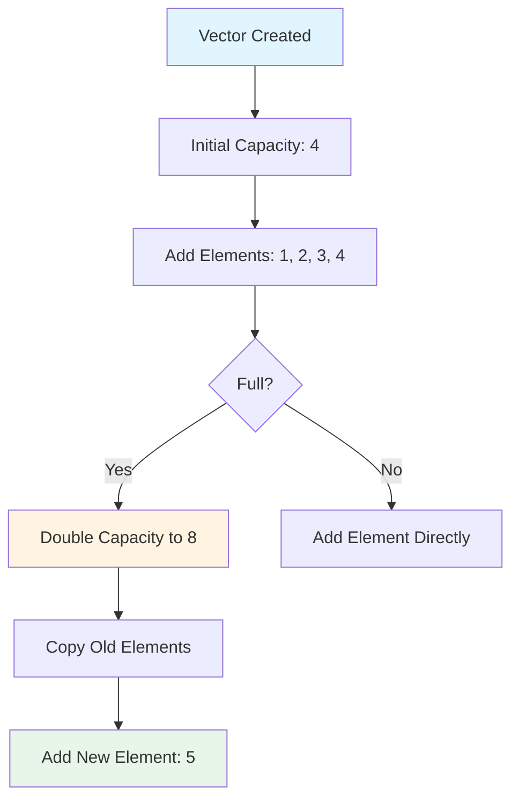
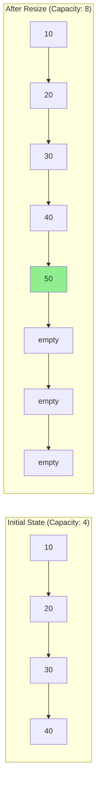
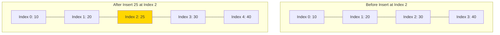

## What is a Vector?

A **vector** is a dynamic array that can automatically resize itself when elements are added or removed. Think of it as a smart container that grows and shrinks as needed, unlike traditional arrays which have a fixed size.

### Real-World Analogy

Imagine a parking lot:
- A **regular array** is like a parking lot with exactly 10 spaces. Once full, you can't add more cars without building a new lot.
- A **vector** is like a parking lot that automatically expands when it gets full, adding more spaces as needed.

## Key Characteristics

### 1. **Dynamic Size**
- Automatically grows when you add elements
- Can shrink to save memory
- No need to specify size at creation

### 2. **Contiguous Memory**
- Elements stored next to each other in memory
- Fast access to any element by index
- Cache-friendly performance

### 3. **Random Access**
- Access any element directly using its index
- O(1) time complexity for access

## How Vectors Work Internally



### Memory Allocation Strategy

When a vector runs out of space:
1. **Allocate** new memory (usually 2x current capacity)
2. **Copy** all existing elements to new location
3. **Delete** old memory
4. **Add** the new element

## Vector Operations

### Basic Operations and Time Complexity

| Operation | Time Complexity | Description |
|-----------|----------------|-------------|
| **Access** (get/set) | O(1) | Direct index access |
| **Push Back** (add to end) | O(1)* | Amortized constant time |
| **Pop Back** (remove from end) | O(1) | Remove last element |
| **Insert** (at position) | O(n) | May need to shift elements |
| **Delete** (at position) | O(n) | May need to shift elements |
| **Search** | O(n) | Linear search needed |

*Amortized O(1) means occasional O(n) during resize, but averaged out over many operations.

## Visual Representation

### Vector Growth Example



### Insert Operation (Middle)



## Code Examples

### C++ Example
```cpp
#include <vector>
#include <iostream>

int main() {
    // Create a vector
    std::vector<int> numbers;
    
    // Add elements
    numbers.push_back(10);
    numbers.push_back(20);
    numbers.push_back(30);
    
    // Access elements
    std::cout << numbers[0] << std::endl;  // Output: 10
    
    // Size and capacity
    std::cout << "Size: " << numbers.size() << std::endl;
    std::cout << "Capacity: " << numbers.capacity() << std::endl;
    
    // Insert at position
    numbers.insert(numbers.begin() + 1, 15);
    
    // Remove last element
    numbers.pop_back();
    
    // Iterate
    for(int num : numbers) {
        std::cout << num << " ";
    }
    
    return 0;
}
```

### Python Example (List behaves like Vector)
```python
# Create a list (Python's dynamic array)
numbers = []

# Add elements
numbers.append(10)
numbers.append(20)
numbers.append(30)

# Access elements
print(numbers[0])  # Output: 10

# Insert at position
numbers.insert(1, 15)

# Remove last element
numbers.pop()

# Iterate
for num in numbers:
    print(num, end=" ")
```

## Advantages vs Disadvantages

### ✅ Advantages

1. **Dynamic Sizing** - No need to know size in advance
2. **Fast Random Access** - O(1) access to any element
3. **Cache Friendly** - Contiguous memory improves performance
4. **Easy to Use** - Simple interface for common operations
5. **Automatic Memory Management** - Handles allocation/deallocation

### ❌ Disadvantages

1. **Insertion/Deletion** - Expensive in middle (O(n))
2. **Reallocation Cost** - Occasional expensive resize operation
3. **Memory Overhead** - May allocate more than needed
4. **Wasted Space** - Extra capacity not always used

## When to Use Vectors

### ✅ Use Vector When:
- You need dynamic array functionality
- Random access is important
- Mostly adding/removing from the end
- Size changes frequently
- Memory locality matters for performance

### ❌ Don't Use Vector When:
- Frequent insertions/deletions in middle
- Size is fixed and known beforehand
- Need constant-time insertion at both ends (use deque)
- Working with very large objects (consider storing pointers)

## Common Use Cases

1. **Collection Management** - Storing lists of items
2. **Dynamic Buffers** - Reading data of unknown size
3. **Stack Implementation** - Using push_back/pop_back
4. **Graph Adjacency Lists** - Vector of vectors
5. **Game Development** - Entity lists, particle systems

## Memory Layout Visualization

```
Regular Array (Fixed Size):
[10][20][30][40]
 ↑   ↑   ↑   ↑
 0   1   2   3  (Indices)

Vector (Dynamic):
[10][20][30][40][  ][  ][  ][  ]
 ↑   ↑   ↑   ↑   ↑____________↑
 Size = 4        Capacity = 8
 (Used space)    (Reserved space)
```

## Performance Considerations

### Amortized Analysis

Although resizing takes O(n) time, it happens infrequently:
- Adding n elements requires resizing approximately log₂(n) times
- Total cost: n + n/2 + n/4 + ... + 1 ≈ 2n
- **Amortized cost per insertion: O(1)**

### Reserve Capacity

```cpp
vector<int> vec;
vec.reserve(1000);  // Pre-allocate space
// Now adding 1000 elements won't trigger resizing
```

This avoids multiple reallocations when you know the approximate size.

## Key Takeaways

1. Vectors are **dynamic arrays** that grow automatically
2. **O(1)** access and end operations, **O(n)** middle operations
3. Trade **space** (extra capacity) for **time** (amortized constant insertion)
4. Perfect for **sequential access** and **back operations**
5. **Contiguous memory** makes them cache-efficient

## Related Data Structures

- **Array** - Fixed-size, no dynamic growth
- **Linked List** - O(1) insertion anywhere, but O(n) access
- **Deque** - Like vector but efficient at both ends
- **Dynamic Array** - Generic term for vector-like structures

---

**Remember**: *Vectors are one of the most commonly used data structures because they provide a great balance of simplicity, flexibility, and performance for most use cases!
