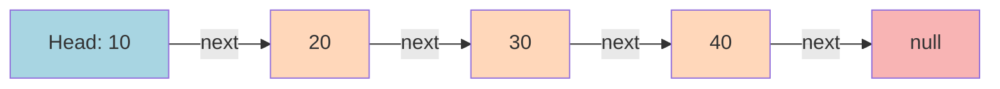
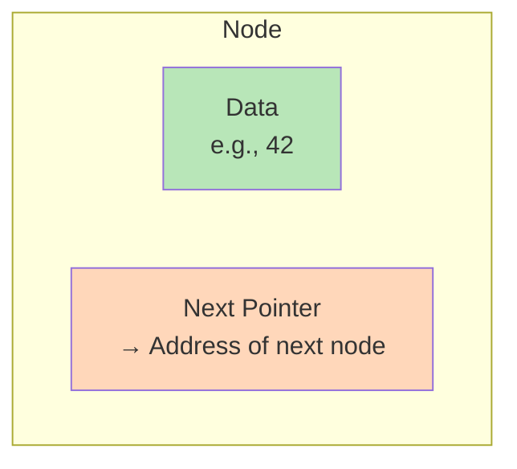
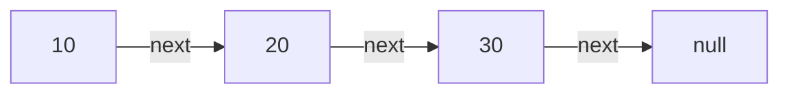
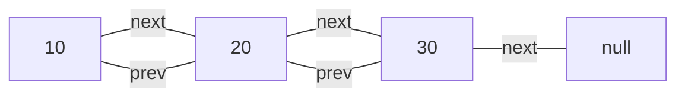
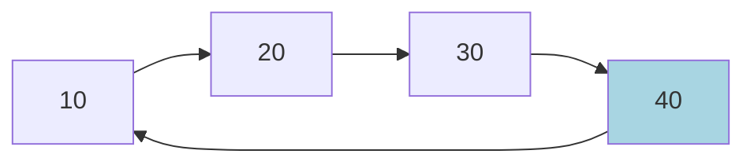
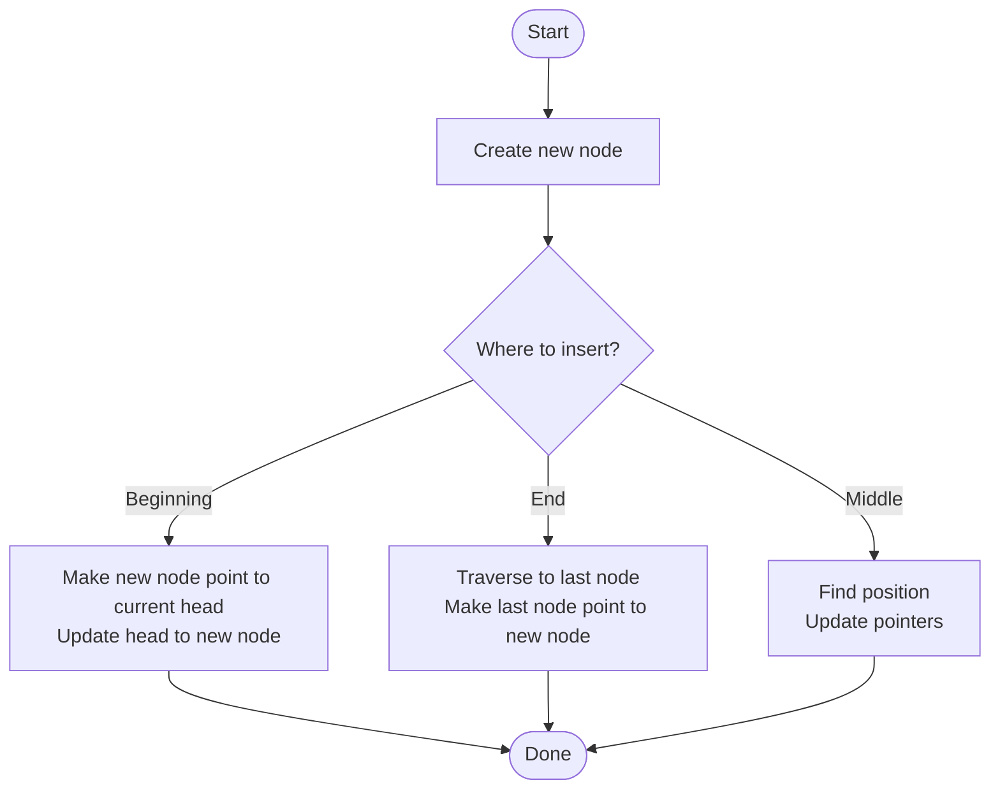
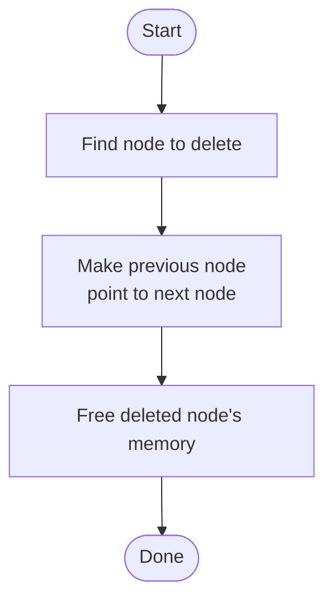
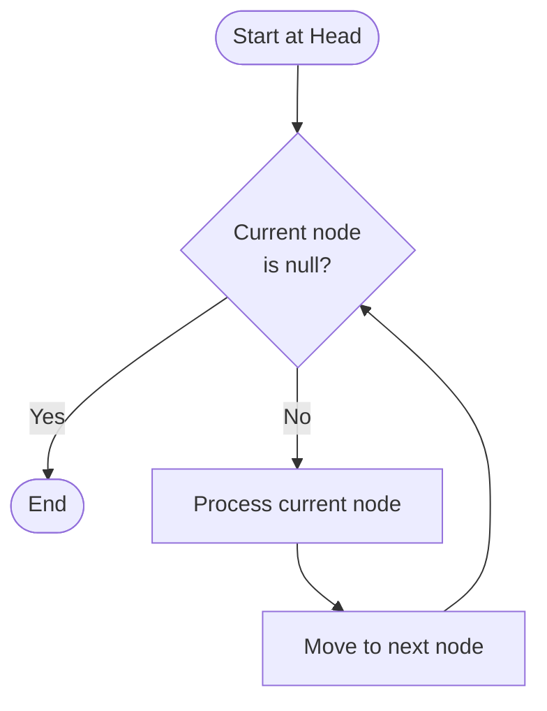

## Simple Definition

A **linked list** is a data structure that stores a collection of elements (called nodes) where each element points to the next one in the sequence, like a chain of connected boxes.

Think of it like a treasure hunt where each clue tells you where to find the next clue!

## Visual Representation



## How It's Different from Arrays

### Array (Fixed neighbors in memory)
```
Index:  0    1    2    3    4
       [10] [20] [30] [40] [50]  ← All boxes are next to each other
```

### Linked List (Connected by pointers)
```
[10]─→ [20]─→ [30]─→ [40]─→ [50]─→ null
 ↑                                    ↑
Head                                 End
```

**Key Differences:**
- **Array**: Elements are stored in consecutive memory locations
- **Linked List**: Elements can be anywhere in memory, connected by "pointers"

## Structure of a Node

Each element in a linked list is called a **node**. A node contains two parts:



### Example in Code (Pseudocode)
```
Node {
    data: value to store
    next: pointer to next node
}
```

## Types of Linked Lists

### 1. Singly Linked List
Each node points to the next node only.



### 2. Doubly Linked List
Each node points to both the next AND previous node.



### 3. Circular Linked List
The last node points back to the first node (forming a circle).



## Basic Operations

### 1. Insertion (Adding a new node)



**Example: Insert 25 between 20 and 30**
```
Before: [10]→[20]→[30]→null

Step 1: Create new node [25]
Step 2: Make [25] point to [30]
Step 3: Make [20] point to [25]

After:  [10]→[20]→[25]→[30]→null
```

### 2. Deletion (Removing a node)



**Example: Delete 20**
```
Before: [10]→[20]→[30]→null

Step 1: Make [10] point to [30]
Step 2: Remove [20]

After:  [10]→[30]→null
```

### 3. Traversal (Visiting each node)



## Advantages of Linked Lists

✅ **Dynamic Size**: Can grow or shrink easily
- No need to declare size in advance
- Add or remove elements without reorganizing entire structure

✅ **Easy Insertion/Deletion**: Just change a few pointers
- No need to shift elements like in arrays
- Especially fast at the beginning

✅ **Memory Efficient**: No wasted space
- Allocates memory as needed

## Disadvantages of Linked Lists

❌ **No Random Access**: Must traverse from the beginning
- Can't jump directly to element 100
- Slower to access specific positions

❌ **Extra Memory**: Each node needs space for pointer(s)
- Arrays only store data
- Linked lists store data + pointer(s)

❌ **Not Cache Friendly**: Elements scattered in memory
- Arrays have better memory locality
- Linked lists can be slower due to cache misses

## Real-World Analogies

1. **Train Cars**: Each car is connected to the next, you can add or remove cars easily
2. **Treasure Hunt**: Each clue leads to the next location
3. **Chain Link**: Each link connects to the next one
4. **Music Playlist**: Each song points to the next song

## When to Use Linked Lists?

**Use Linked Lists When:**
- You need frequent insertions/deletions (especially at beginning)
- You don't know the size in advance
- You don't need random access to elements
- Memory allocation should be dynamic

**Use Arrays When:**
- You need fast random access by index
- You know the size in advance
- Memory is limited (no pointer overhead)
- You need better cache performance

## Time Complexity Summary

| Operation | Array | Linked List |
|-----------|-------|-------------|
| Access by index | O(1) | O(n) |
| Search | O(n) | O(n) |
| Insert at beginning | O(n) | O(1) |
| Insert at end | O(1) | O(n) |
| Delete at beginning | O(n) | O(1) |
| Delete at end | O(1) | O(n) |

*Note: For doubly linked lists with tail pointer, insert/delete at end is O(1)*

## Simple Example Code (Python-like)

```python
# Define a Node
class Node:
    def __init__(self, data):
        self.data = data
        self.next = None

# Create nodes
node1 = Node(10)
node2 = Node(20)
node3 = Node(30)

# Link them together
node1.next = node2
node2.next = node3

# Traverse and print
current = node1
while current is not None:
    print(current.data)
    current = current.next

# Output: 10, 20, 30
```

## Key Takeaways

1. Linked lists store data in nodes connected by pointers
2. They provide dynamic size and easy insertion/deletion
3. Trade-off: No random access like arrays
4. Multiple types: singly, doubly, and circular
5. Choose based on your specific use case needs

---

