```cpp

#include <iostream>
using namespace std;

// Creating a node
class Node 

{
public:
    int value;
    Node * next;
};

int main() 

{
    
    Node* head;
    
    Node* Node1 = NULL;
    Node* Node2 = NULL;
    Node* Node3 = NULL;

    // allocate 3 nodes in the heap
    Node1 = new Node();
    Node2 = new Node();
    Node3 = new Node();

    // Assign value values
    Node1->value = 1;
    Node2->value = 2;
    Node3->value = 3;

    // Connect nodes
    Node1->next = Node2;
    Node2->next = Node3;
    Node3->next = NULL;

    // print the linked list value
    head = Node1;

    while (head != NULL) {
        cout << head->value <<endl;
        head = head->next;
    }

    system("pause>0");
    return 0;

}
```


---

## 📚 Easy Explanation: Singly Linked List

### What is a Singly Linked List?

A **singly linked list** is like a chain of boxes where each box contains:
1. **Data** (the actual value we want to store)
2. **A pointer** (an arrow pointing to the next box)

Unlike arrays where elements are stored next to each other in memory, linked lists can have their elements scattered anywhere in memory, connected by pointers.

### Visual Representation

```mermaid
graph LR
    A[Head<br/>Points to Node1] --> B[Node1<br/>value: 1<br/>next: →]
    B --> C[Node2<br/>value: 2<br/>next: →]
    C --> D[Node3<br/>value: 3<br/>next: NULL]
    
    style A fill:#e1f5ff
    style B fill:#fff3e0
    style C fill:#fff3e0
    style D fill:#fff3e0
```



### Breaking Down the Code

#### 1️⃣ **Creating the Node Class**
```cpp
class Node {
public:
    int value;      // Stores the data
    Node* next;     // Pointer to the next node
};
```
Think of this as a blueprint for each box in our chain.

#### 2️⃣ **Creating Nodes**
```c++
Node* Node1 = new Node();
Node* Node2 = new Node();
Node* Node3 = new Node();
```
We create 3 separate boxes in memory.

**Visual:**
```
[Node1: ? | ?]    [Node2: ? | ?]    [Node3: ? | ?]
```

#### 3️⃣ **Assigning Values**
```c++
Node1->value = 1;
Node2->value = 2;
Node3->value = 3;
```

**Visual:**
```
[Node1: 1 | ?]    [Node2: 2 | ?]    [Node3: 3 | ?]
```

#### 4️⃣ **Connecting Nodes (The Key Part!)**
```cpp
Node1->next = Node2;  // Node1's arrow points to Node2
Node2->next = Node3;  // Node2's arrow points to Node3
Node3->next = NULL;   // Node3's arrow points to nothing (end of list)
```

**Visual:**
```
[Node1: 1 | →] → [Node2: 2 | →] → [Node3: 3 | NULL]
```

#### 5️⃣ **Traversing (Walking Through) the List**
```cpp
head = Node1;  // Start from the first node

while (head != NULL) {
    cout << head->value << endl;  // Print current value
    head = head->next;            // Move to next node
}
```

### Step-by-Step Traversal


### Output
```
1
2
3
```

### Key Concepts to Remember

| Concept | Explanation |
|---------|-------------|
| **Node** | A container with data and a pointer to the next node |
| **Head** | The starting point of the linked list |
| **next** | Pointer that connects one node to another |
| **NULL** | Marks the end of the list (no more nodes) |

### Advantages vs Arrays

✅ **Advantages:**
- Dynamic size (can grow/shrink easily)
- Easy insertion/deletion at beginning

❌ **Disadvantages:**
- No random access (must traverse from head)
- Extra memory for pointers
- More complex than arrays

### Memory Diagram

```
Memory Layout:

Arrays:          [1][2][3]  ← Continuous memory
                  ↑  ↑  ↑
                  All connected addresses

Linked List:     [1|→]     [2|→]     [3|NULL]
                  @100      @500      @800
                            ↑ Scattered in memory, connected by pointers
```

### Real-World Analogy 🎯

Think of a **treasure hunt**:
- Each clue (node) tells you where to find the next clue
- You must follow clues in order (can't skip to the end)
- The last clue says "You've found the treasure!" (NULL)
- The first clue is like the **head** pointer

This is exactly how a singly linked list works!