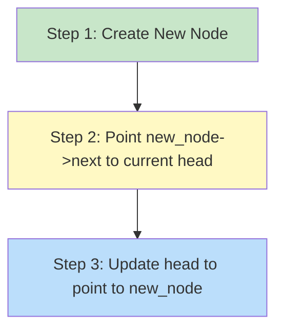
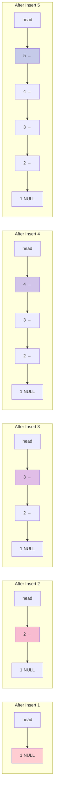
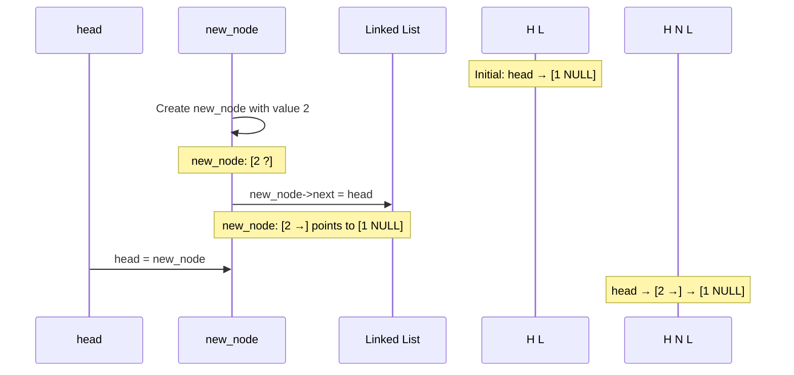

```cpp
#include <iostream>
using namespace std;

// Create a node
class Node 
{
public:
    int value;
    Node* next;
};

void InsertAtBeginning(Node* &head, int value) 
{
    
    // Allocate memory to a node
    Node * new_node = new Node();

    // insert the data
    new_node->value = value;
    new_node->next = head;

    // Move head to new node
    head = new_node;
   
}

// Print the linked list
void PrintList( Node* head) 

{
    while (head != NULL) {
        cout << head->value << " ";
        head = head->next;
    }
}

int main() 
{
    Node * head = NULL;

    InsertAtBeginning(head, 1);
    InsertAtBeginning(head, 2);
    InsertAtBeginning(head, 3);
    InsertAtBeginning(head, 4);
    InsertAtBeginning(head, 5);

    PrintList(head);

    system("pause>0");

}
```


---

## 📚 Easy Explanation: Insert At Beginning Operation

### What Does "Insert At Beginning" Mean?

Inserting at the beginning means adding a new node **before** the current first node (head) of the linked list. It's like adding a new person at the front of a line!

### Why Insert At Beginning?

✅ **Super Fast!** - Takes only O(1) time (constant time)
✅ **No Traversal** - Don't need to walk through the entire list
✅ **Simple Logic** - Just 3 steps!

---

## 🎯 The Algorithm - 3 Simple Steps



---

## 📊 Visual Step-by-Step Example

Let's trace what happens when we run the main function:

### Initial State
```
head = NULL
```

**Visual:**
```
head → NULL
```

---

### After `InsertAtBeginning(head, 1)`

**Step 1:** Create new node with value 1
```
new_node: [1 | ?]
head → NULL
```

**Step 2:** Point new_node->next to current head (NULL)
```
new_node: [1 | NULL]
head → NULL
```

**Step 3:** Update head to new_node
```
head → [1 | NULL]
```

---

### After `InsertAtBeginning(head, 2)`

**Before:**
```
head → [1 | NULL]
```

**Step 1:** Create new node with value 2
```
new_node: [2 | ?]
head → [1 | NULL]
```

**Step 2:** Point new_node->next to current head
```
new_node: [2 | →] ----→ [1 | NULL]
head → [1 | NULL]
```

**Step 3:** Update head to new_node
```
head → [2 | →] → [1 | NULL]
```

---

### Complete Sequence Visualization



---

## 🔍 Code Breakdown

### The Function Signature
```cpp
void InsertAtBeginning(Node* &head, int value)
```

**Important:** Notice the `&` in `Node* &head`
- This is a **reference parameter**
- Allows us to modify the actual head pointer
- Without `&`, changes wouldn't persist outside the function

---

### Inside the Function

#### Step 1️⃣: Create New Node
```cpp
Node* new_node = new Node();
```
Allocates memory for a new node on the heap.

#### Step 2️⃣: Set Value and Link
```cpp
new_node->value = value;        // Store the data
new_node->next = head;          // Point to current first node
```

**Visual:**
```
new_node: [value | →] → [old head]
```

#### Step 3️⃣: Update Head
```cpp
head = new_node;
```
Now the new node becomes the first node!

**Visual:**
```
head → [new_node] → [old head] → ...
```

---

## 🎬 Animation of Insert Process



---

## 📋 Execution Trace Table

| Step | Function Call | List State | Notes |
|------|--------------|------------|-------|
| 0 | Initial | `NULL` | Empty list |
| 1 | `InsertAtBeginning(head, 1)` | `1 → NULL` | First node |
| 2 | `InsertAtBeginning(head, 2)` | `2 → 1 → NULL` | 2 is now first |
| 3 | `InsertAtBeginning(head, 3)` | `3 → 2 → 1 → NULL` | 3 is now first |
| 4 | `InsertAtBeginning(head, 4)` | `4 → 3 → 2 → 1 → NULL` | 4 is now first |
| 5 | `InsertAtBeginning(head, 5)` | `5 → 4 → 3 → 2 → 1 → NULL` | 5 is now first |

### Final Output
```
5 4 3 2 1
```

**Notice:** The order is **reversed**! Last inserted = First in list

---

## 🎯 Real-World Analogies

### 1. **Stack of Plates** 🍽️
- Adding a new plate on top of the stack
- The newest plate is always on top (beginning)
- You always add/remove from the top

### 2. **Line at a Store** 🏪
- Someone cuts to the front of the line
- They become the new first person
- Everyone else shifts back one position

### 3. **Browser History** 🌐
- Each new page you visit goes to the front
- The most recent page is always first
- Older pages are pushed back

---

## ⚡ Time Complexity Analysis

| Operation | Time Complexity | Why? |
|-----------|----------------|------|
| **Insert at Beginning** | O(1) | Only 3 operations, no loops |
| **Traversal/Print** | O(n) | Must visit each node |
| **Space** | O(1) | Only one new node created |

**O(1) means:** No matter how long the list is (10 nodes or 10,000 nodes), inserting at the beginning takes the same amount of time!

---

## 🔑 Key Points to Remember

1. **Reference Parameter (`&`)**: Essential for modifying the actual head pointer
2. **Three Steps**: Create → Link → Update head
3. **Order**: New elements go to the **front**, creating reverse order
4. **Efficiency**: Fastest insertion method for linked lists (O(1))
5. **No Traversal**: We never need to walk through the list

---

## ❓ Common Questions

**Q: Why use `Node* &head` instead of `Node* head`?**
A: Without `&`, we'd only modify a local copy. The original head wouldn't change!

**Q: What if head is NULL?**
A: No problem! `new_node->next = NULL` and `head = new_node` works perfectly.

**Q: Why is the output 5 4 3 2 1 instead of 1 2 3 4 5?**
A: Because each new number is inserted at the **beginning**, pushing older numbers back.

**Q: Can we make it print 1 2 3 4 5?**
A: Yes! Either insert at the end, or insert in reverse order (5, 4, 3, 2, 1).

---

## 🎓 Practice Challenge

Try to predict the output:
```cpp
Node* head = NULL;
InsertAtBeginning(head, 10);
InsertAtBeginning(head, 20);
InsertAtBeginning(head, 30);
PrintList(head);
```

<details>
<summary>Click to see answer</summary>

Output: `30 20 10`

Why? 30 was inserted last, so it's at the beginning!
</details>

