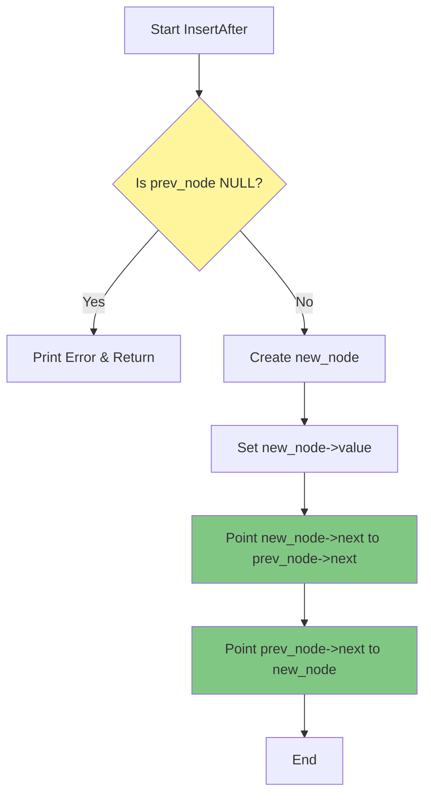

The **Insert After** operation allows you to insert a new node at a specific position in a linked list - right after a given node. This is one of the fundamental operations for manipulating linked lists.

## Why Use Insert After?

- Insert elements at specific positions without rebuilding the entire list
- More efficient than inserting at the end when you already have a reference to a node
- Useful for maintaining sorted lists or inserting data in logical positions

## How It Works

### Visual Representation


**After inserting 500 after node with value 2:**


## Step-by-Step Process

### Step 1: Find the Target Node

First, you need to find the node after which you want to insert the new node.

```c++
Node* N1 = Find(head, 2);  // Find node with value 2
```

### Step 2: Create New Node

Create a new node with the value you want to insert.

```c++
Node* new_node = new Node();
new_node->value = 500;
```

### Step 3: Link the New Node

This is the critical part - we need to update the links in the correct order:



**Important:** The order matters!

1. **First:** Make the new node point to what the previous node was pointing to
   ```cpp
   new_node->next = prev_node->next;
   ```

2. **Second:** Make the previous node point to the new node
   ```cpp
   prev_node->next = new_node;
   ```

### Why Order Matters

If you reverse the order, you'll lose the reference to the rest of the list!

❌ **Wrong Order:**
```cpp
prev_node->next = new_node;  // We lost the reference to the next nodes!
new_node->next = prev_node->next;  // This now points to new_node (itself)
```

✅ **Correct Order:**
```cpp
new_node->next = prev_node->next;  // Save the reference first
prev_node->next = new_node;  // Then update the previous node
```

## Complete Code Example

```cpp
// Insert a node after a specific node
void InsertAfter(Node* prev_node, int Value) {
    
    // Safety check: make sure prev_node exists
    if (prev_node == NULL) {
        cout << "The given previous node cannot be NULL";
        return;
    }
    
    // Create new node
    Node* new_node = new Node();
    new_node->value = Value;
    
    // Link the new node (order is important!)
    new_node->next = prev_node->next;
    prev_node->next = new_node;
}
```

## Usage Example

```cpp
// Create list: 5 -> 4 -> 3 -> 2 -> 1
Node* head = NULL;
InsertAtBeginning(head, 1);
InsertAtBeginning(head, 2);
InsertAtBeginning(head, 3);
InsertAtBeginning(head, 4);
InsertAtBeginning(head, 5);

PrintList(head);  // Output: 5 4 3 2 1

// Find node with value 2
Node* N1 = Find(head, 2);

// Insert 500 after node with value 2
InsertAfter(N1, 500);

PrintList(head);  // Output: 5 4 3 2 500 1
```

## Time Complexity

| Operation | Time Complexity | Explanation |
|-----------|----------------|-------------|
| **Insert After** | O(1) | Constant time - only updating two pointers |
| **Find Node** | O(n) | Linear time - may need to traverse entire list |
| **Total** | O(n) | Dominated by the search operation |

## Edge Cases to Handle

### 1. NULL Previous Node
```cpp
if (prev_node == NULL) {
    cout << "Error: Cannot insert after NULL node";
    return;
}
```

### 2. Inserting After Last Node
```cpp
// If prev_node is the last node, prev_node->next will be NULL
// new_node->next = NULL (automatically handled)
// prev_node->next = new_node (now points to new last node)
```

### 3. Empty List
If the list is empty (head is NULL), you cannot use InsertAfter. Use `InsertAtBeginning` instead.

## Comparison with Other Insert Operations

| Operation | Use Case | Complexity |
|-----------|----------|------------|
| **Insert at Beginning** | Always insert at front | O(1) |
| **Insert After** | Insert at specific position | O(1)* |
| **Insert at End** | Always insert at end | O(n) |

*O(1) if you already have the node reference, O(n) if you need to find it first.

## Key Takeaways

1. **Always check for NULL** before inserting
2. **Order of operations matters** - save the next reference first
3. **InsertAfter is O(1)** - very efficient when you have the node reference
4. **Combine with Find()** to insert at any position in the list
5. **Works anywhere** - beginning, middle, or end of the list

## Practice Exercise

Try implementing these variations:

1. `InsertBefore(Node* next_node, int Value)` - Insert before a given node
2. `InsertAtPosition(Node*& head, int Value, int position)` - Insert at index position
3. `InsertSorted(Node*& head, int Value)` - Insert in sorted order

---

