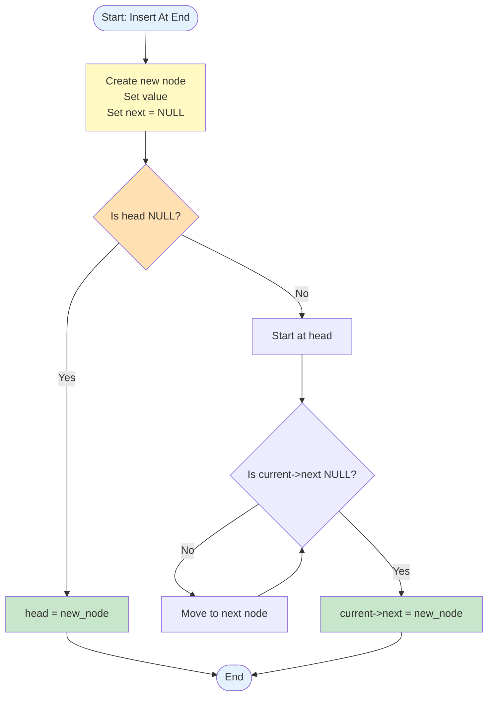

## Overview

**Insert At End** is a fundamental linked list operation that adds a new node at the end of the list. This operation requires traversing the entire list to find the last node, then linking the new node to it.

## Visual Representation

### Before Insertion


### After Inserting Value 500


## Algorithm Steps

### Step-by-Step Process

1. **Create a new node** with the desired value
2. **Set the new node's next pointer to NULL** (it will be the last node)
3. **Check if the list is empty** (head == NULL)
   - If empty: Make the new node the head
   - If not empty: Continue to step 4
4. **Traverse to the last node** (the node whose next pointer is NULL)
5. **Link the last node to the new node**

### Flowchart



## Code Implementation

```cpp
void InsertAtEnd(Node* &head, int Value) {
   
    // Step 1: Create new node
    Node* new_node = new Node();
    new_node->value = Value;
    new_node->next = NULL;

    // Step 2: Check if list is empty
    if (head == NULL) {
        head = new_node;
        return;
    }

    // Step 3: Traverse to the last node
    Node* LastNode = head;
    while (LastNode->next != NULL)
    {
        LastNode = LastNode->next;
    }

    // Step 4: Link the last node to new node
    LastNode->next = new_node;
    return;
}
```

## Detailed Example

Let's walk through inserting value `500` into a list containing `[1, 2, 3]`:

### Initial State
```
Head → [1] → [2] → [3] → NULL
```

### Step 1: Create New Node
```
new_node: [500] → NULL
```

### Step 2: List Not Empty
```
head ≠ NULL, so we continue...
```

### Step 3: Traverse to Last Node
```
LastNode = head          → [1]
LastNode->next ≠ NULL    → Move to [2]
LastNode->next ≠ NULL    → Move to [3]
LastNode->next == NULL   → Stop at [3]
```

### Step 4: Link Last Node to New Node
```
[3]->next = new_node

Result: Head → [1] → [2] → [3] → [500] → NULL
```

## Time and Space Complexity

| Complexity | Value | Explanation |
|------------|-------|-------------|
| **Time Complexity** | O(n) | Must traverse entire list to find the last node |
| **Space Complexity** | O(1) | Only allocates memory for one new node |

## Key Points to Remember

✅ **Always set new node's next to NULL** - It will be the last node

✅ **Handle empty list case** - When head is NULL, new node becomes the head

✅ **Pass head by reference** - Use `Node* &head` to modify the original head pointer

✅ **Traverse until next is NULL** - The last node is the one whose next pointer is NULL

## Common Use Cases

- Building a list by adding elements one by one
- Maintaining insertion order (FIFO when combined with delete from beginning)
- Queue implementation using linked lists
- Appending data to existing collections

## Comparison with Other Insert Operations

| Operation | Time Complexity | When to Use |
|-----------|----------------|-------------|
| **Insert At Beginning** | O(1) | When order doesn't matter or implementing a stack |
| **Insert At End** | O(n) | When maintaining insertion order is important |
| **Insert After Node** | O(1) | When you have a reference to a specific node |

## Practice Example

```cpp
int main()
{
    Node* head = NULL;
  
    InsertAtEnd(head, 1);    // List: [1]
    InsertAtEnd(head, 2);    // List: [1, 2]
    InsertAtEnd(head, 3);    // List: [1, 2, 3]
    InsertAtEnd(head, 500);  // List: [1, 2, 3, 500]

    PrintList(head);         // Output: 1 2 3 500
}
```

