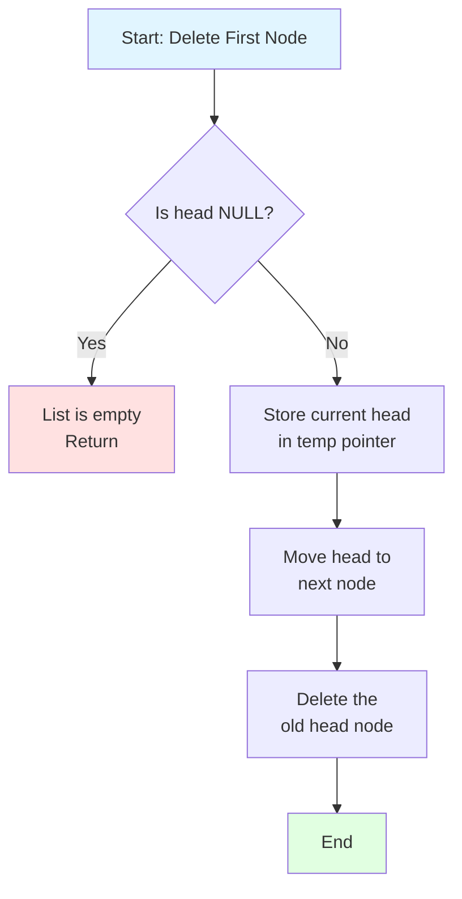

Deleting the first node in a linked list is one of the simplest deletion operations. It involves removing the head node and updating the head pointer to point to the second node in the list.

## Visual Representation

### Before Deletion

```
Head → [1|•] → [2|•] → [3|•] → [4|NULL]
       ^^^
   First Node
```

### After Deletion

```
       [1|•]  (deleted from memory)
       
Head → [2|•] → [3|•] → [4|NULL]
       ^^^
   New First Node
```

## Step-by-Step Process



## Algorithm Breakdown

### Steps:

1. **Check if list is empty**
   - If `head == NULL`, the list is empty, so we simply return

2. **Store the current head**
   - Create a temporary pointer to hold the current head node
   - This allows us to delete it after updating the head pointer

3. **Update the head pointer**
   - Move `head` to point to the second node (`head->next`)
   - This makes the second node the new first node

4. **Free the memory**
   - Delete the old head node using the temporary pointer
   - This prevents memory leaks

## Code Implementation

```cpp
void DeleteFirstNode(Node*& head) {
    // Step 1: Store current head
    Node* Current = head;

    // Step 2: Check if list is empty
    if (head == NULL) {
        return;
    }

    // Step 3: Move head to next node
    head = Current->next;
    
    // Step 4: Free memory
    delete Current;
    return;
}
```

## Detailed Example

Let's trace through deleting the first node from a list: `1 → 2 → 3 → 4 → 5`

### Initial State:
```
head → [1] → [2] → [3] → [4] → [5] → NULL
```

### Step 1: Create temporary pointer
```
Current → [1] → [2] → [3] → [4] → [5] → NULL
head ----↗
```

### Step 2: Update head pointer
```
Current → [1]
           ↓
head -----→ [2] → [3] → [4] → [5] → NULL
```

### Step 3: Delete the old node
```
Current → [X] (freed from memory)
           
head → [2] → [3] → [4] → [5] → NULL
```

### Final Result:
```
Output: 2 3 4 5
```

## Time and Space Complexity

| Operation | Complexity | Explanation |
|-----------|------------|-------------|
| **Time** | O(1) | Constant time - always just 3 steps regardless of list size |
| **Space** | O(1) | Only uses one temporary pointer |

## Edge Cases to Consider

### 1. Empty List
```c++
head = NULL
// Function returns immediately, no deletion occurs
```

### 2. Single Node List
```c++
Before: head → [1] → NULL
After:  head → NULL
// List becomes empty
```

### 3. Two Node List
```c++
Before: head → [1] → [2] → NULL
After:  head → [2] → NULL
// Second node becomes the head
```

## Common Mistakes to Avoid

1. **Forgetting to check for NULL**
   ```cpp
   // ❌ Wrong - will crash if list is empty
   head = head->next;
   delete head;
   ```

2. **Deleting before updating head**
   ```cpp
   // ❌ Wrong - loses reference to rest of list
   delete head;
   head = head->next; // head is now invalid!
   ```

3. **Not freeing memory**
   ```cpp
   // ❌ Wrong - memory leak
   head = head->next; // Old head is lost but not freed
   ```

## Why We Pass by Reference

The function signature uses `Node*& head` (reference to pointer):

```c++
void DeleteFirstNode(Node*& head)  // ✅ Correct
```

**Reason:** We need to modify the actual head pointer in the calling function. If we used `Node* head`, changes would only affect the local copy.

## Comparison with Other Deletion Operations

| Operation | Complexity | Notes |
|-----------|------------|-------|
| Delete First | O(1) | Simplest - direct access |
| Delete Last | O(n) | Must traverse entire list |
| Delete at Position | O(n) | Must traverse to position |
| Delete by Value | O(n) | Must search for value |

## Practical Use Cases

- **Stack implementation** - Pop operation removes first element
- **Queue implementation** - Dequeue operation removes first element
- **Undo/Redo functionality** - Removing most recent action
- **Browser history** - Removing oldest visited page

## Key Takeaways

✅ Deleting the first node is the fastest deletion operation (O(1))
✅ Always check if the list is empty before deletion
✅ Always free memory to prevent memory leaks
✅ Update the head pointer before deleting the old node
✅ Use pass-by-reference to modify the actual head pointer

---
