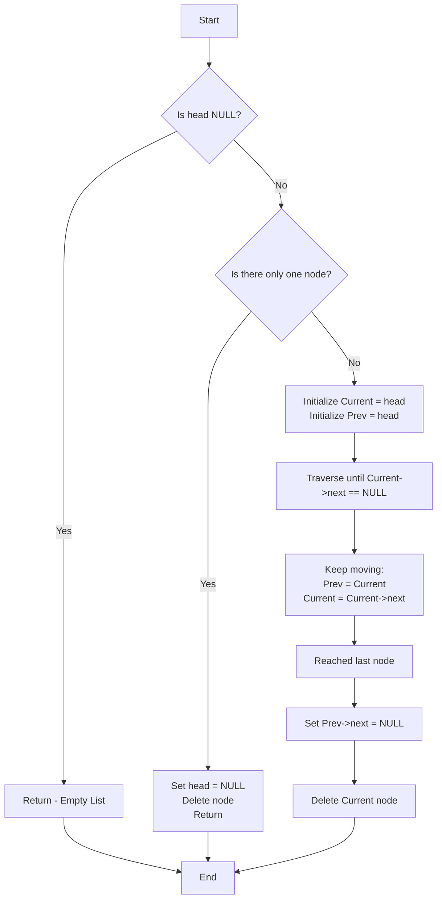

## Overview

The **Delete Last Node** operation removes the final node from a linked list. This operation requires traversing the entire list to find the last node and updating the second-to-last node's `next` pointer to `NULL`.

## Visual Representation

### Before Deletion

```
Head → [1] → [2] → [3] → [4] → NULL
       ↑                    ↑
     First                Last
```

### After Deletion

```
Head → [1] → [2] → [3] → NULL
       ↑              ↑
     First          New Last
```

## Algorithm Steps



## Implementation Details

### Step-by-Step Process

1. **Check if list is empty**
   - If `head == NULL`, there's nothing to delete
   - Return immediately

2. **Check if there's only one node**
   - If `head->next == NULL`, the head is the only node
   - Set `head = NULL`
   - Delete the node and return

3. **Traverse to the last node**
   - Use two pointers: `Current` and `Prev`
   - Move through the list until `Current->next == NULL`
   - `Prev` will point to the second-to-last node

4. **Update the link**
   - Set `Prev->next = NULL` (make the second-to-last node the new last node)

5. **Free memory**
   - Delete the `Current` node to prevent memory leaks

## Code Example

```cpp
void DeleteLastNode(Node*& head)
{
    Node* Current = head;
    Node* Prev = head;

    // Case 1: Empty list
    if (head == NULL)
    {
        return;
    }

    // Case 2: Only one node
    if (Current->next == NULL) {
        head = NULL;
        delete Current;
        return;
    }

    // Case 3: Multiple nodes - traverse to last
    while (Current != NULL && Current->next != NULL) {
        Prev = Current;
        Current = Current->next;
    }

    // Update the second-to-last node's next pointer
    Prev->next = NULL;
    
    // Free the memory
    delete Current;
}
```

## Detailed Example

### Initial List
```
Head → [1] → [2] → [3] → [4] → [5] → NULL
```

### Traversal Process

**Step 1:** Initialize pointers
```
       Prev
       Current
         ↓
Head → [1] → [2] → [3] → [4] → [5] → NULL
```

**Step 2:** Move through the list
```
                              Prev  Current
                                ↓      ↓
Head → [1] → [2] → [3] → [4] → [5] → NULL
```

**Step 3:** Update pointer and delete
```
                              Prev
                                ↓
Head → [1] → [2] → [3] → [4] → NULL    [5] deleted
```

### Final Result
```
Head → [1] → [2] → [3] → [4] → NULL
```

## Time and Space Complexity

| Complexity | Value | Explanation |
|------------|-------|-------------|
| **Time** | O(n) | Must traverse entire list to reach last node |
| **Space** | O(1) | Only uses two pointer variables |

## Edge Cases to Consider

### 1. Empty List
```c++
head == NULL
// Action: Return without doing anything
```

### 2. Single Node
```c++
Head → [1] → NULL
// Action: Set head = NULL, delete node
```

### 3. Two Nodes
```c++
Head → [1] → [2] → NULL
// Action: Set node[1]->next = NULL, delete node[2]
```

## Common Mistakes to Avoid

1. **Forgetting to check for empty list**
   - Always verify `head != NULL` before proceeding

2. **Not handling single node case**
   - Must set `head = NULL` when deleting the only node

3. **Memory leak**
   - Always `delete` the node after unlinking it

4. **Not updating the previous node's pointer**
   - Must set `Prev->next = NULL` before deleting

## When to Use This Operation

- **Stack implementation** (when using linked list as stack)
- **Undo functionality** (removing most recent action)
- **Queue operations** (if implementing from the wrong end)
- **List truncation** (removing elements from the end)

## Comparison with Other Delete Operations

| Operation | Time Complexity | Notes |
|-----------|-----------------|-------|
| Delete First | O(1) | Direct access to head |
| Delete Last | O(n) | Must traverse entire list |
| Delete by Value | O(n) | Must search for value |
| Delete at Position | O(n) | Must traverse to position |

## Practice Tips

To master this operation:

1. Draw the list on paper and trace through each step
2. Practice identifying the `Prev` and `Current` pointers at each step
3. Always check edge cases (empty, single node)
4. Remember: the second-to-last node becomes the new last node


---

**Key Takeaway:** Deleting the last node requires O(n) time because we must traverse the entire list to find it. This is one reason why doubly linked lists (with previous pointers) can be more efficient for this operation.
