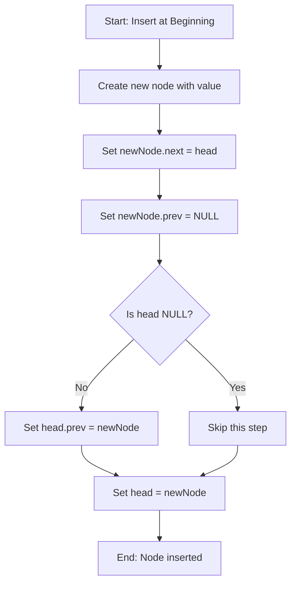

## Overview

Inserting a node at the beginning of a doubly linked list is one of the fundamental operations. This operation adds a new node before the current head and updates all necessary pointers.

## What is a Doubly Linked List?

A doubly linked list is a data structure where each node contains:
- **Value**: The data stored in the node
- **Next pointer**: Reference to the next node
- **Previous pointer**: Reference to the previous node

This bidirectional structure allows traversal in both forward and backward directions.

## Visual Representation

### Initial List Structure
```
NULL <--> [1] <--> [2] <--> [500] <--> NULL
```

### Node Structure
```
┌─────────────────┐
│  Previous (prev)│ ──→ Points to previous node
├─────────────────┤
│   Value         │ ──→ Stores the data
├─────────────────┤
│  Next (next)    │ ──→ Points to next node
└─────────────────┘
```

## Algorithm Steps

When inserting a new node at the beginning, we follow these steps:

### Step 1: Create a New Node
Create a new node and assign it the desired value.

```
newNode
┌─────────────────┐
│  prev = ?       │
├─────────────────┤
│  value = X      │
├─────────────────┤
│  next = ?       │
└─────────────────┘
```

### Step 2: Set New Node's Next Pointer
Point the new node's `next` to the current head.

```
newNode.next = head
```

**Before:**
```
newNode              Head
   [ X ]     →     [1] <--> [2] <--> [500] <--> NULL
```

### Step 3: Set New Node's Previous Pointer
Set the new node's `prev` to NULL (since it will be the first node).

```
newNode.prev = NULL
```

**State:**
```
NULL <-- [ X ]  →  [1] <--> [2] <--> [500] <--> NULL
```

### Step 4: Update Old Head's Previous Pointer
If the list is not empty, set the old head's `prev` to point to the new node.

```
if (head != NULL) {
    head.prev = newNode
}
```

**State:**
```
NULL <-- [ X ] <--> [1] <--> [2] <--> [500] <--> NULL
```

### Step 5: Update Head Pointer
Finally, make the new node the new head of the list.

```
head = newNode
```

**Final Result:**
```
         Head
          ↓
NULL <-- [ X ] <--> [1] <--> [2] <--> [500] <--> NULL
```

## Flowchart



## Code Implementation

```cpp
void InsertAtBeginning(Node*& head, int value) {
    // Step 1: Create a new node
    Node* newNode = new Node();
    newNode->value = value;
    
    // Step 2: Set next pointer
    newNode->next = head;
    
    // Step 3: Set previous pointer
    newNode->prev = NULL;
    
    // Step 4: Update old head's previous pointer
    if (head != NULL) {
        head->prev = newNode;
    }
    
    // Step 5: Update head
    head = newNode;
}
```

## Example Execution

Let's trace through inserting values 1, 2, 3, 4, 5:

### Insert 5 (First node)
```
head = NULL
After: NULL <-- [5] --> NULL
```

### Insert 4
```
Before: NULL <-- [5] --> NULL
After:  NULL <-- [4] <--> [5] --> NULL
```

### Insert 3
```
Before: NULL <-- [4] <--> [5] --> NULL
After:  NULL <-- [3] <--> [4] <--> [5] --> NULL
```

### Insert 2
```
Before: NULL <-- [3] <--> [4] <--> [5] --> NULL
After:  NULL <-- [2] <--> [3] <--> [4] <--> [5] --> NULL
```

### Insert 1 (Final)
```
Before: NULL <-- [2] <--> [3] <--> [4] <--> [5] --> NULL
After:  NULL <-- [1] <--> [2] <--> [3] <--> [4] <--> [5] --> NULL
```

## Time and Space Complexity

| Operation | Complexity | Explanation |
|-----------|------------|-------------|
| **Time** | O(1) | Constant time - only pointer updates |
| **Space** | O(1) | Only one new node created |

## Key Points to Remember

1. **Always update in order**: next pointer → prev pointer → old head's prev → new head
2. **Check for NULL**: Always verify if the head is NULL before updating `head->prev`
3. **Constant Time**: This operation is very efficient, taking O(1) time regardless of list size
4. **Memory Allocation**: Remember to allocate memory for the new node using `new`
5. **Pass by Reference**: The head pointer must be passed by reference (`Node*& head`) to modify it

## Common Mistakes to Avoid

❌ **Forgetting to update old head's prev pointer**
```cpp
// Wrong - missing head->prev update
newNode->next = head;
head = newNode;  // Old head still points prev to wrong node!
```

❌ **Not checking if head is NULL**
```cpp
// Wrong - will crash if list is empty
 head->prev = newNode;  // head might be NULL!
```

❌ **Wrong order of operations**
```cpp
// Wrong - updating head before setting old head's prev
head = newNode;
head->prev = newNode;  // This sets newNode->prev = newNode (circular!)
```

## Advantages of Insert at Beginning

✅ **Fast**: O(1) time complexity
✅ **Simple**: Only a few pointer updates needed
✅ **No traversal**: Don't need to iterate through the list
✅ **Works on empty lists**: Handles the edge case naturally


---

