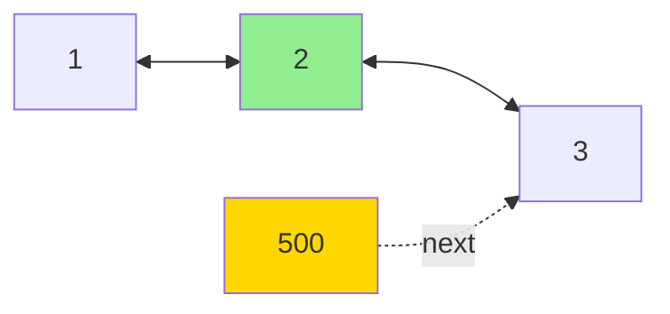
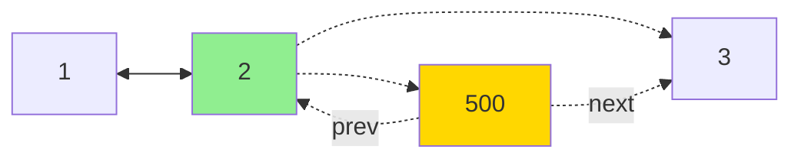
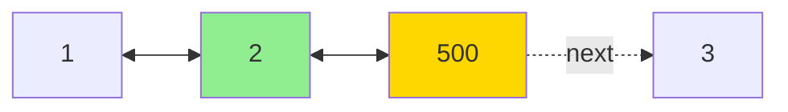
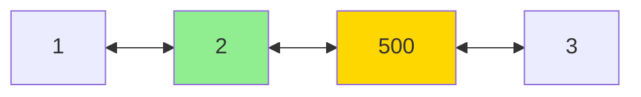

## Overview

The **Insert After** operation adds a new node immediately after a specified node in a doubly linked list. This operation maintains the bidirectional links between all nodes.

## Visual Representation

### Before Insertion
```
NULL <--> 1 <--> 2 <--> 3 <--> 4 <--> 5 <--> NULL
```

### After Inserting 500 after node with value 2
```
NULL <--> 1 <--> 2 <--> 500 <--> 3 <--> 4 <--> 5 <--> NULL
```

## Step-by-Step Process

### Initial State

*We want to insert 500 after node 2*

### Step 1: Create New Node
```
newNode = new Node()
newNode->value = 500
```

### Step 2: Link New Node's Next to Current's Next
```
newNode->next = current->next
```


### Step 3: Link New Node's Prev to Current Node
```
newNode->prev = current
```


### Step 4: Update Current's Next to New Node
```
current->next = newNode
```


### Step 5: Update Next Node's Prev (if exists)
```
if (current->next != NULL)
    current->next->prev = newNode
```


## Complete Code

```cpp
void InsertAfter(Node* current, int value) {
    // Step 1: Create a new node with the desired value
    Node* newNode = new Node();
    newNode->value = value;
    
    // Step 2: Set the next pointer of the new node 
    // to the next node of the current node
    newNode->next = current->next;
    
    // Step 3: Set the previous pointer of the new node 
    // to the current node
    newNode->prev = current;
    
    // Step 4: Set the next pointer of the current node 
    // to the new node
    if (current->next != NULL) {
        current->next->prev = newNode;
    }
    
    // Step 5: Update the current node's next pointer
    current->next = newNode;
}
```

## Algorithm Summary

1. **Create** a new node with the desired value
2. **Link forward**: Set new node's `next` to current node's `next`
3. **Link backward**: Set new node's `prev` to current node
4. **Update next node**: If next node exists, set its `prev` to new node
5. **Update current node**: Set current node's `next` to new node

## Key Points to Remember

- ✅ Always update **4 pointers** (2 in the new node, 2 in adjacent nodes)
- ✅ Check if `current->next` is NULL before updating
- ✅ The order of operations matters to avoid losing references
- ✅ Both forward (`next`) and backward (`prev`) links must be maintained

## Time & Space Complexity

- **Time Complexity**: O(1) - Constant time, just pointer updates
- **Space Complexity**: O(1) - Only one new node created

## Common Use Cases

- Inserting elements in the middle of a list
- Building ordered lists
- Implementing undo/redo functionality
- Managing playlists or navigation history

## Example Usage

```cpp
// Create a list: 1 <--> 2 <--> 3 <--> 4 <--> 5
Node* head = NULL;
InsertAtBeginning(head, 5);
InsertAtBeginning(head, 4);
InsertAtBeginning(head, 3);
InsertAtBeginning(head, 2);
InsertAtBeginning(head, 1);

// Find node with value 2
Node* N1 = Find(head, 2);

// Insert 500 after node 2
InsertAfter(N1, 500);

// Result: 1 <--> 2 <--> 500 <--> 3 <--> 4 <--> 5
```

## Potential Errors to Avoid

⚠️ **Dereferencing NULL**: Always check if `current` is NULL before calling InsertAfter
⚠️ **Wrong order**: Setting `current->next` before `newNode->next` loses the reference
⚠️ **Forgetting prev update**: Not updating the next node's `prev` pointer breaks backward traversal

---

 